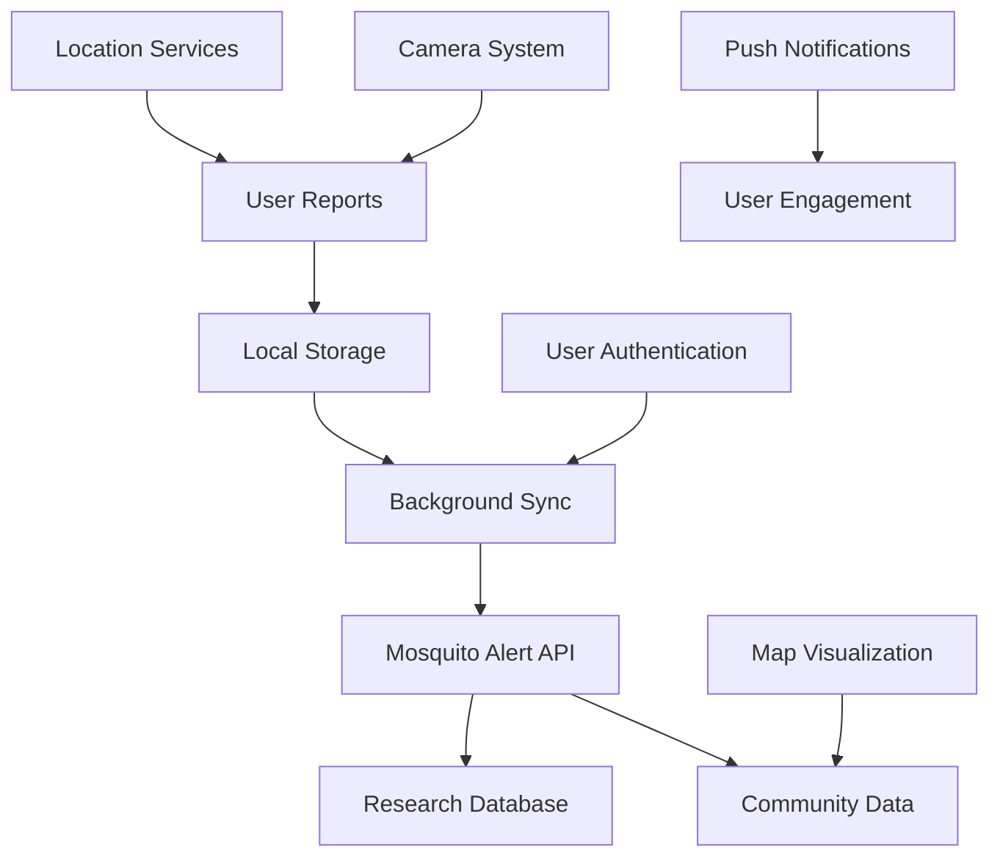

# Project Overview

## 🌍 Mission & Purpose

The Mosquito Alert Mobile App is a citizen science application designed to engage the public in mosquito surveillance and control efforts. By crowdsourcing mosquito sightings, bites, and breeding site reports, the app contributes valuable data to researchers and public health officials working to understand and mitigate mosquito-borne disease risks.

## 📱 App Core Features

### Primary Functions
1. **Mosquito Reporting**: Users can photograph and report mosquito sightings
2. **Mosquito Reporting**: Users can report mosquito bites
3. **Breeding Site Reporting**: Documentation of potential mosquito breeding areas
4. **Location Tracking**: GPS-based location data for all reports
5. **Photo Management**: Image capture, compression, and storage
6. **Data Synchronization**: Offline capability with background sync
7. **Community Engagement**: View mosquito activity in the area

### Secondary Features
- User authentication and profile management
- Multi-language support (22 languages)
- Push notifications for updates and reminders
- Background data synchronization
- Map visualization of mosquito activity
- Educational content about mosquitoes

## 🏗️ Technical Architecture

### Framework & Platform
- **Framework**: Flutter 3.3.0+ for cross-platform development
- **Target Platforms**: iOS (12.0+) and Android (API 21+)
- **Language**: Dart with null safety
- **Development**: FVM (Flutter Version Management) for version control

### Key Dependencies
Based on `pubspec.yaml` analysis:

#### Core Flutter Packages
- `flutter`: ^3.3.0 - Core Flutter framework
- `cupertino_icons`: ^1.0.2 - iOS-style icons

#### State Management & Architecture
- `provider`: ^6.1.2 - State management using Provider pattern
- `collection`: ^1.17.2 - Enhanced collection utilities

#### Networking & API
- `dio`: ^5.4.3+1 - HTTP client for API communication
- `connectivity_plus`: ^6.0.3 - Network connectivity monitoring

#### Location & Maps
- `google_maps_flutter`: ^2.6.1 - Map display and interaction
- `location`: ^5.0.3 - GPS location services
- `geolocator`: ^10.1.0 - Enhanced geolocation features

#### Camera & Media
- `camera`: ^0.10.5+9 - Camera functionality
- `flutter_image_compress`: ^2.2.0 - Image compression
- `image_picker`: ^1.0.7 - Image selection from gallery
- `file_picker`: ^6.2.1 - File system access

#### Storage & Persistence
- `shared_preferences`: ^2.2.2 - Simple key-value storage
- `flutter_secure_storage`: ^9.0.0 - Secure credential storage
- `path_provider`: ^2.1.2 - File system path access

#### Background Processing
- `workmanager`: ^0.5.2 - Background task execution
- `flutter_background_service`: ^5.0.5 - Long-running background services

#### Firebase Services
- `firebase_core`: ^2.27.1 - Firebase initialization
- `firebase_analytics`: ^10.8.10 - Usage analytics
- `firebase_messaging`: ^14.7.20 - Push notifications

#### UI & User Experience
- `flutter_local_notifications`: ^17.0.0 - Local notifications
- `permission_handler`: ^11.3.0 - Runtime permission management
- `package_info_plus`: ^6.0.0 - App version information
- `url_launcher`: ^6.2.5 - External URL handling

## 🎯 User Types & Personas

### Primary Users
1. **Citizen Scientists**: General public interested in contributing to mosquito research
2. **Nature Enthusiasts**: People who spend time outdoors and encounter mosquitoes
3. **Community Members**: Residents concerned about mosquito activity in their area

### Secondary Users
1. **Researchers**: Scientists analyzing mosquito data
2. **Public Health Officials**: Government agencies tracking disease vectors
3. **Educators**: Teachers using the app for environmental education

## 📊 Data Flow Overview

## 🌐 Supported Regions

The app supports mosquito reporting globally with particular focus on:
- Europe (primary deployment region)
- Mediterranean countries
- Areas with tiger mosquito (*Aedes albopictus*) presence
- Regions participating in Mosquito Alert research initiatives

## 🔄 Development Lifecycle

### Environment Management
- **Development**: `main_dev.dart` with development configuration
- **Testing**: `main_test.dart` for testing environment
- **Production**: `main_prod.dart` for release builds

### Configuration Files
- `assets/config/dev.json` - Development settings
- `assets/config/test.json` - Testing configuration
- `assets/config/prod.json` - Production configuration

## 📈 Key Performance Indicators

### Technical Metrics
- App startup time
- Photo upload success rate
- Background synchronization reliability
- Crash-free sessions percentage

### User Engagement Metrics
- Daily active users
- Report submission frequency
- Photo quality acceptance rate
- User retention over time

## 🚀 Future Roadmap

### Planned Features
- Enhanced species identification with AI
- Improved offline capabilities
- Real-time mosquito activity alerts
- Gamification elements for user engagement
- Integration with additional research platforms

### Technical Improvements
- Performance optimizations
- Enhanced accessibility features
- Improved battery usage optimization
- Advanced caching strategies
