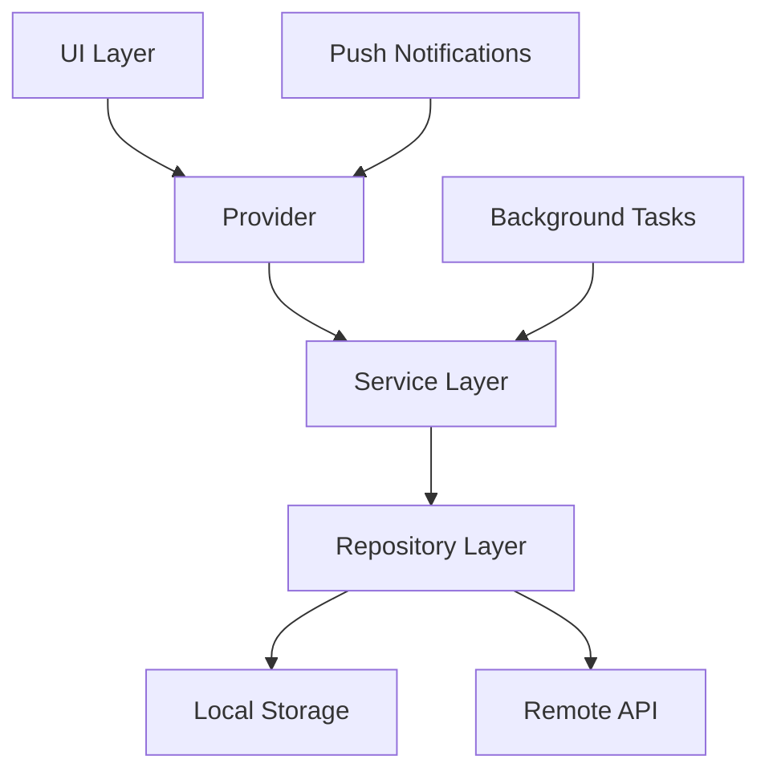
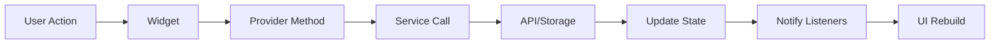
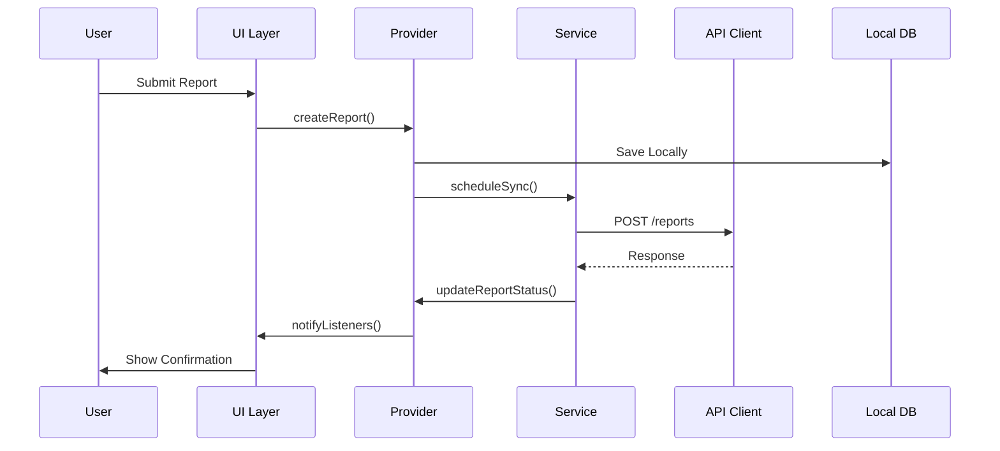
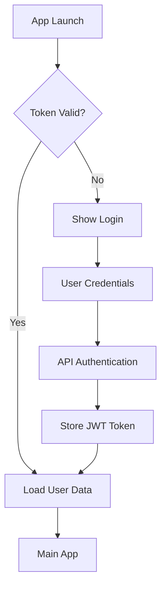

# Architecture Guide

## 🏗️ Overall Architecture

The Mosquito Alert app follows a layered architecture pattern with clear separation of concerns, making use of Flutter's reactive programming model and the Provider pattern for state management.

## 📁 Directory Structure

```
lib/
├── api/                  # API layer - HTTP clients and endpoints
│   ├── api_client.dart   # Main API client configuration
│   ├── endpoints/        # API endpoint definitions
│   └── interceptors/     # HTTP interceptors (auth, logging, retry)
├── models/               # Data models and DTOs
│   ├── user.dart        # User data models
│   ├── report.dart      # Report data structures
│   └── mosquito.dart    # Mosquito-specific models
├── pages/                # UI screens and page controllers
│   ├── home/            # Home screen components
│   ├── report/          # Reporting flow screens
│   ├── map/             # Map visualization pages
│   └── profile/         # User profile screens
├── providers/            # State management (Provider pattern)
│   ├── app_data_provider.dart     # Global app state
│   ├── user_data_provider.dart    # User session management
│   ├── report_data_provider.dart  # Report management
│   └── map_data_provider.dart     # Map data handling
├── services/             # Business logic and external services
│   ├── auth_service.dart         # Authentication logic
│   ├── location_service.dart     # GPS and location handling
│   ├── sync_service.dart         # Data synchronization
│   └── notification_service.dart # Push notifications
├── utils/                # Utility functions and helpers
│   ├── constants.dart    # App constants
│   ├── helpers.dart      # General utility functions
│   └── validators.dart   # Input validation
└── main.dart            # Application entry point
```

## 🔧 Core Architecture Patterns

### 1. Provider Pattern Implementation

The app uses the Provider pattern for state management, providing a reactive approach to data flow:

```dart
// Example Provider structure
class AppDataProvider with ChangeNotifier {
  // Private state
  bool _isLoading = false;
  List<Report> _reports = [];
  
  // Public getters
  bool get isLoading => _isLoading;
  List<Report> get reports => _reports;
  
  // State modification methods
  void setLoading(bool loading) {
    _isLoading = loading;
    notifyListeners();
  }
  
  Future<void> addReport(Report report) async {
    _reports.add(report);
    notifyListeners();
    await _syncToServer(report);
  }
}
```

### 2. Service Layer Architecture

Services encapsulate business logic and external integrations:

```dart
// Service layer example
class LocationService {
  static final LocationService _instance = LocationService._internal();
  factory LocationService() => _instance;
  LocationService._internal();
  
  Future<Position> getCurrentLocation() async {
    // Location logic implementation
  }
  
  Stream<Position> getLocationStream() {
    // Real-time location updates
  }
}
```

### 3. Repository Pattern

Data access is abstracted through repositories:



## 🔄 Data Flow Architecture

### State Management Flow



### Report Submission Flow



## 🎯 Key Architectural Components

### 1. API Client Architecture

The API client uses Dio with custom interceptors:

```dart
class ApiClient {
  late Dio _dio;
  
  ApiClient() {
    _dio = Dio();
    _setupInterceptors();
  }
  
  void _setupInterceptors() {
    _dio.interceptors.addAll([
      AuthInterceptor(),      // JWT token management
      LoggingInterceptor(),   // Request/response logging
      RetryInterceptor(),     // Automatic retry logic
      ErrorInterceptor(),     // Centralized error handling
    ]);
  }
}
```

### 2. Local Storage Strategy

Multi-layered storage approach:

- **SharedPreferences**: User preferences, app settings
- **Secure Storage**: Authentication tokens, sensitive data
- **File System**: Photos, cached data, offline reports

```dart
class StorageService {
  // Regular preferences
  static const String KEY_USER_ID = 'user_id';
  
  // Secure storage
  static const FlutterSecureStorage _secureStorage = FlutterSecureStorage();
  
  // File paths
  static Future<String> get _localPath async {
    final directory = await getApplicationDocumentsDirectory();
    return directory.path;
  }
}
```

### 3. Background Processing Architecture

Using WorkManager for reliable background tasks:

```dart
class BackgroundSyncService {
  static void initialize() {
    Workmanager().initialize(callbackDispatcher);
  }
  
  static void scheduleSync() {
    Workmanager().registerPeriodicTask(
      "sync-reports",
      "syncReportsTask",
      frequency: Duration(hours: 1),
    );
  }
}

@pragma('vm:entry-point')
void callbackDispatcher() {
  Workmanager().executeTask((task, inputData) async {
    // Background sync logic
    return Future.value(true);
  });
}
```

## 🔐 Security Architecture

### Authentication Flow



### Data Protection

- **Sensitive Data**: Stored in Flutter Secure Storage
- **API Communication**: HTTPS with certificate pinning
- **Local Files**: Encrypted for sensitive content
- **Permissions**: Runtime permission requests

## 📱 Platform-Specific Architecture

### iOS Integration

```yaml
# ios/Runner/Info.plist
<key>NSLocationWhenInUseUsageDescription</key>
<string>Location access for mosquito reports</string>
<key>NSCameraUsageDescription</key>
<string>Camera access for photo reports</string>
```

### Android Integration

```gradle
// android/app/build.gradle
android {
    compileSdkVersion 34
    
    defaultConfig {
        minSdkVersion 21
        targetSdkVersion 34
    }
}
```

## 🚀 Performance Architecture

### Memory Management

- **Image Compression**: Automatic resizing and compression
- **Cache Strategy**: LRU cache for map tiles and images
- **Stream Management**: Proper disposal of subscriptions

### Network Optimization

- **Request Batching**: Multiple reports in single API call
- **Offline Queue**: Local storage with sync retry logic
- **Data Compression**: GZIP compression for API requests

### Battery Optimization

- **Background Limits**: Minimal background processing
- **Location Updates**: Balanced accuracy vs. battery usage
- **Network Calls**: Batched and scheduled efficiently

## 🧪 Testing Architecture

### Unit Testing Structure

```
test/
├── unit/
│   ├── providers/
│   ├── services/
│   └── utils/
├── widget/
│   ├── pages/
│   └── components/
└── integration/
    └── flows/
```

### Test Patterns

```dart
// Provider testing example
testWidgets('ReportProvider should add report', (tester) async {
  final provider = ReportDataProvider();
  final report = Report(id: '1', type: 'mosquito');
  
  await provider.addReport(report);
  
  expect(provider.reports.length, 1);
  expect(provider.reports.first.id, '1');
});
```

## 🔧 Build & Deployment Architecture

### Environment Configuration

```dart
// app_config.dart
class AppConfig {
  static String get apiUrl {
    switch (BuildConfig.environment) {
      case Environment.dev:
        return 'https://dev-api.mosquitoalert.com';
      case Environment.prod:
        return 'https://api.mosquitoalert.com';
      default:
        return 'https://test-api.mosquitoalert.com';
    }
  }
}
```

### CI/CD Integration

- **Development**: Automatic builds on feature branches
- **Testing**: Automated test runs and coverage reports
- **Staging**: Pre-production testing environment
- **Production**: Release builds with proper signing
