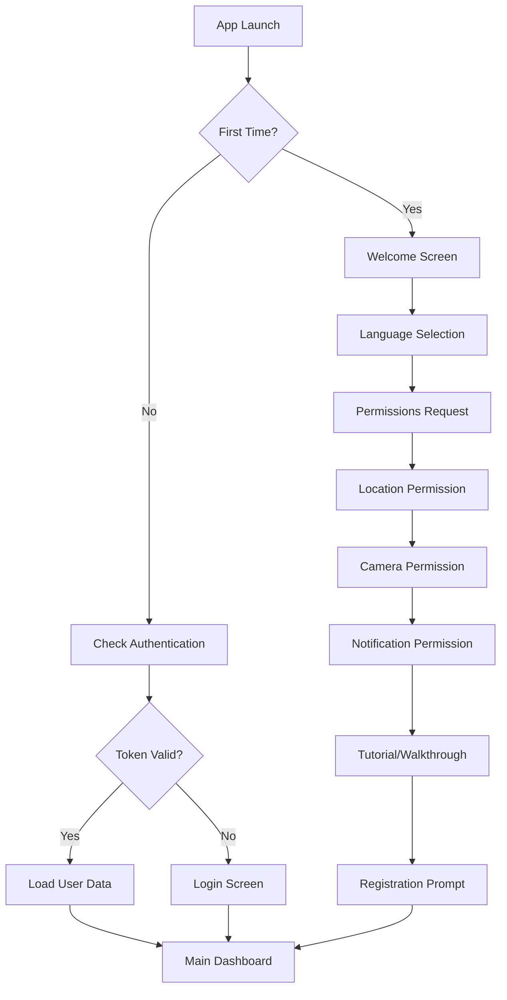
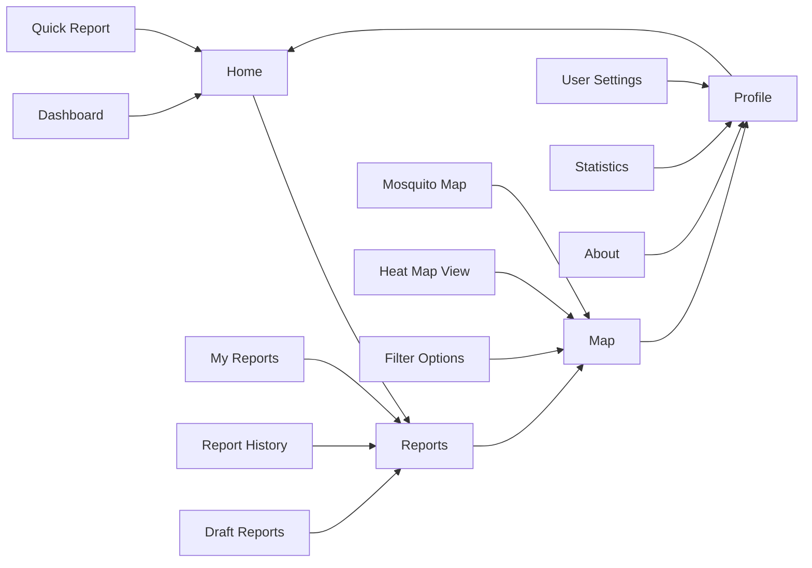
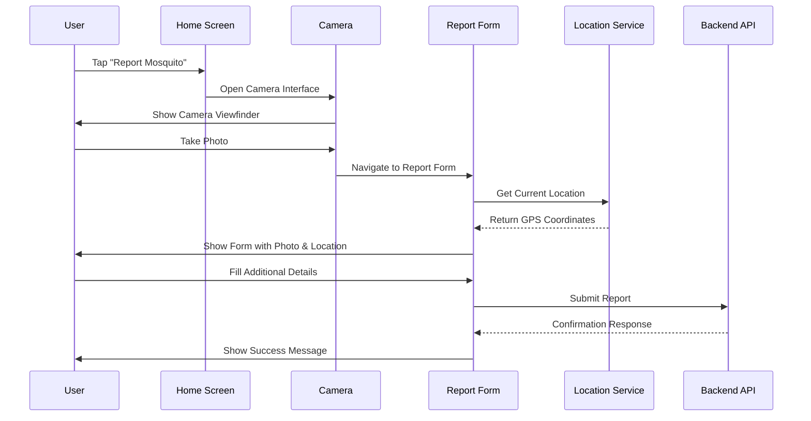
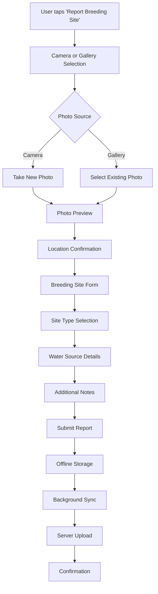
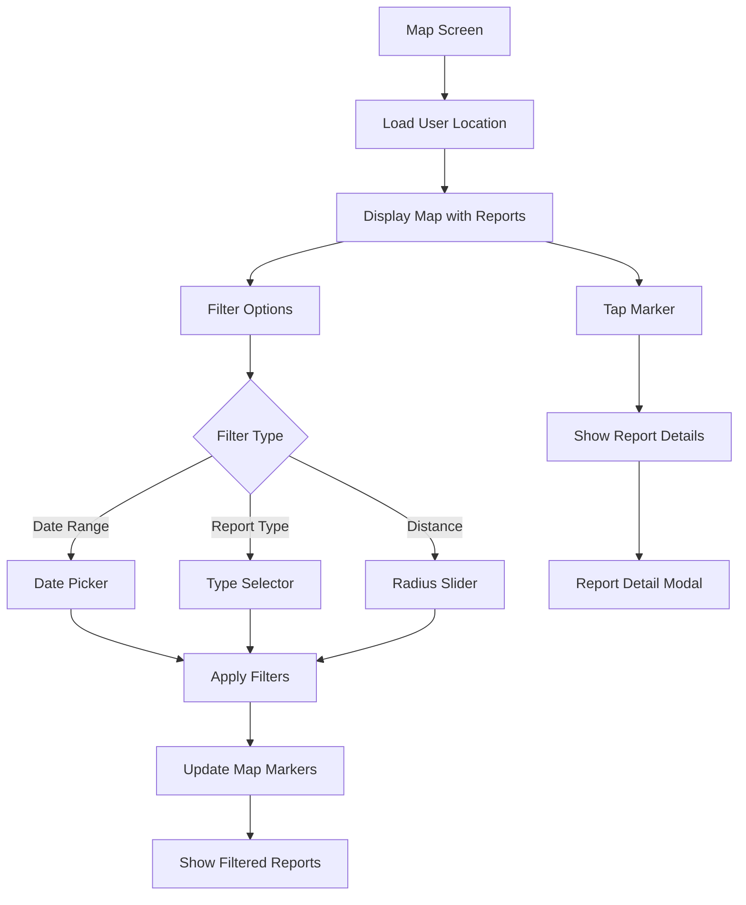
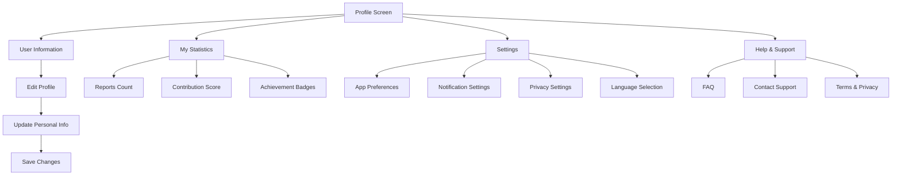
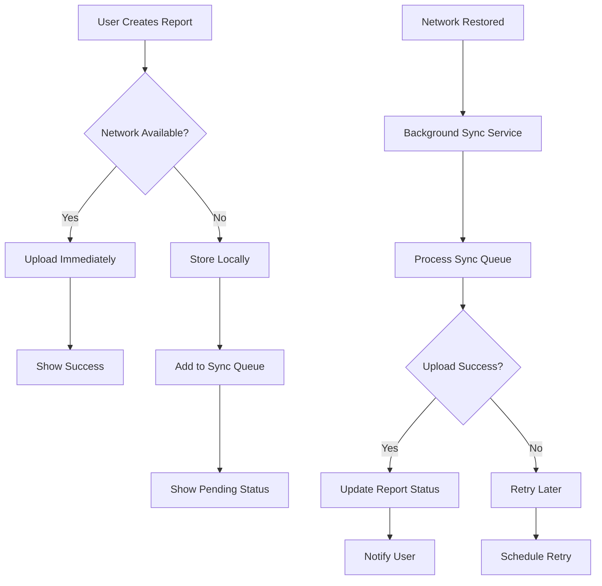
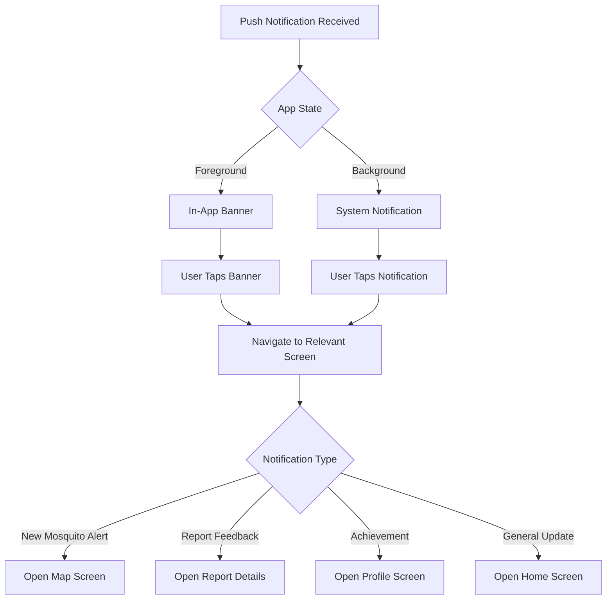

# User Flow & Navigation

## 🚀 App Launch & Onboarding

### First Launch Flow



### Permission Request Flow

The app requests permissions strategically during onboarding:

1. **Location Permission**: Essential for geotagging reports
2. **Camera Permission**: Required for photo capture
3. **Notification Permission**: For engagement and updates
4. **Storage Permission**: For offline data management

## 🏠 Main Navigation Structure

### Bottom Navigation Tabs



### Navigation Implementation

```dart
class MainNavigationScreen extends StatefulWidget {
  @override
  _MainNavigationScreenState createState() => _MainNavigationScreenState();
}

class _MainNavigationScreenState extends State<MainNavigationScreen> {
  int _currentIndex = 0;
  
  final List<Widget> _pages = [
    HomeScreen(),
    ReportsScreen(),
    MapScreen(),
    ProfileScreen(),
  ];
  
  @override
  Widget build(BuildContext context) {
    return Scaffold(
      body: _pages[_currentIndex],
      bottomNavigationBar: BottomNavigationBar(
        currentIndex: _currentIndex,
        onTap: (index) => setState(() => _currentIndex = index),
        items: [
          BottomNavigationBarItem(icon: Icon(Icons.home), label: 'Home'),
          BottomNavigationBarItem(icon: Icon(Icons.report), label: 'Reports'),
          BottomNavigationBarItem(icon: Icon(Icons.map), label: 'Map'),
          BottomNavigationBarItem(icon: Icon(Icons.person), label: 'Profile'),
        ],
      ),
    );
  }
}
```

## 📱 Core User Flows

### 1. Mosquito Report Creation Flow



### Camera Integration Flow

The app uses a WhatsApp-style camera interface for better user experience:

```dart
class CameraScreen extends StatefulWidget {
  @override
  _CameraScreenState createState() => _CameraScreenState();
}

class _CameraScreenState extends State<CameraScreen> {
  CameraController? _controller;
  
  @override
  void initState() {
    super.initState();
    _initializeCamera();
  }
  
  Future<void> _initializeCamera() async {
    final cameras = await availableCameras();
    _controller = CameraController(cameras.first, ResolutionPreset.high);
    await _controller!.initialize();
    setState(() {});
  }
  
  Future<void> _takePicture() async {
    if (_controller?.value.isInitialized ?? false) {
      final image = await _controller!.takePicture();
      Navigator.push(
        context,
        MaterialPageRoute(
          builder: (context) => ReportFormScreen(imagePath: image.path),
        ),
      );
    }
  }
}
```

### 2. Breeding Site Report Flow



### Breeding Site Form Components

```dart
class BreedingSiteForm extends StatefulWidget {
  final String imagePath;
  final Position location;
  
  @override
  _BreedingSiteFormState createState() => _BreedingSiteFormState();
}

class _BreedingSiteFormState extends State<BreedingSiteForm> {
  String? _selectedSiteType;
  String? _waterSource;
  String _notes = '';
  
  final List<String> _siteTypes = [
    'Storm Drain',
    'Flower Pot',
    'Container',
    'Pool/Fountain',
    'Natural Water Body',
    'Other',
  ];
  
  @override
  Widget build(BuildContext context) {
    return Scaffold(
      appBar: AppBar(title: Text('Report Breeding Site')),
      body: Form(
        child: Column(
          children: [
            // Photo preview
            Image.file(File(widget.imagePath)),
            
            // Site type dropdown
            DropdownButtonFormField<String>(
              value: _selectedSiteType,
              items: _siteTypes.map((type) => 
                DropdownMenuItem(value: type, child: Text(type))
              ).toList(),
              onChanged: (value) => setState(() => _selectedSiteType = value),
            ),
            
            // Additional form fields...
            ElevatedButton(
              onPressed: _submitReport,
              child: Text('Submit Report'),
            ),
          ],
        ),
      ),
    );
  }
  
  Future<void> _submitReport() async {
    final report = BreedingSiteReport(
      imagePath: widget.imagePath,
      location: widget.location,
      siteType: _selectedSiteType!,
      waterSource: _waterSource,
      notes: _notes,
    );
    
    await context.read<ReportDataProvider>().submitBreedingSiteReport(report);
    Navigator.popUntil(context, (route) => route.isFirst);
  }
}
```

## 🗺️ Map Navigation Flow

### Map Screen Features



### Map Implementation

```dart
class MapScreen extends StatefulWidget {
  @override
  _MapScreenState createState() => _MapScreenState();
}

class _MapScreenState extends State<MapScreen> {
  GoogleMapController? _mapController;
  Set<Marker> _markers = {};
  
  @override
  Widget build(BuildContext context) {
    return Scaffold(
      appBar: AppBar(
        title: Text('Mosquito Map'),
        actions: [
          IconButton(
            icon: Icon(Icons.filter_list),
            onPressed: _showFilterOptions,
          ),
        ],
      ),
      body: Consumer<MapDataProvider>(
        builder: (context, mapProvider, child) {
          return GoogleMap(
            onMapCreated: (controller) => _mapController = controller,
            initialCameraPosition: CameraPosition(
              target: mapProvider.userLocation ?? LatLng(41.3851, 2.1734),
              zoom: 12.0,
            ),
            markers: _buildMarkers(mapProvider.reports),
            onTap: _onMapTap,
          );
        },
      ),
      floatingActionButton: FloatingActionButton(
        onPressed: _centerOnUserLocation,
        child: Icon(Icons.my_location),
      ),
    );
  }
  
  Set<Marker> _buildMarkers(List<Report> reports) {
    return reports.map((report) => Marker(
      markerId: MarkerId(report.id),
      position: LatLng(report.latitude, report.longitude),
      onTap: () => _showReportDetails(report),
      icon: _getMarkerIcon(report.type),
    )).toSet();
  }
}
```

## 👤 User Profile & Settings Flow

### Profile Screen Navigation



### Settings Implementation

```dart
class SettingsScreen extends StatelessWidget {
  @override
  Widget build(BuildContext context) {
    return Scaffold(
      appBar: AppBar(title: Text('Settings')),
      body: ListView(
        children: [
          ListTile(
            leading: Icon(Icons.notifications),
            title: Text('Notifications'),
            trailing: Consumer<UserDataProvider>(
              builder: (context, userProvider, child) {
                return Switch(
                  value: userProvider.notificationsEnabled,
                  onChanged: (value) => userProvider.setNotifications(value),
                );
              },
            ),
          ),
          ListTile(
            leading: Icon(Icons.language),
            title: Text('Language'),
            trailing: Icon(Icons.arrow_forward_ios),
            onTap: () => _showLanguageSelector(context),
          ),
          ListTile(
            leading: Icon(Icons.privacy_tip),
            title: Text('Privacy Policy'),
            onTap: () => _openPrivacyPolicy(context),
          ),
          // More settings options...
        ],
      ),
    );
  }
  
  void _showLanguageSelector(BuildContext context) {
    showModalBottomSheet(
      context: context,
      builder: (context) => LanguageSelector(),
    );
  }
}
```

## 🔄 Background & Offline Flow

### Offline Report Management



### Sync Service Implementation

```dart
class SyncService {
  static const String SYNC_TASK = 'sync_reports';
  
  static void initialize() {
    Workmanager().initialize(callbackDispatcher);
  }
  
  static Future<void> schedulePendingSync() async {
    await Workmanager().registerOneOffTask(
      SYNC_TASK,
      SYNC_TASK,
      constraints: Constraints(
        networkType: NetworkType.connected,
      ),
    );
  }
  
  static Future<bool> syncPendingReports() async {
    final pendingReports = await LocalStorage.getPendingReports();
    
    for (final report in pendingReports) {
      try {
        await ApiClient.uploadReport(report);
        await LocalStorage.markReportSynced(report.id);
      } catch (e) {
        print('Failed to sync report ${report.id}: $e');
        return false;
      }
    }
    
    return true;
  }
}
```

## 🎯 User Engagement Flows

### Notification Interaction Flow



### Gamification Elements

The app includes subtle gamification to encourage user engagement:

- **Achievement Badges**: For milestones like first report, 10 reports, etc.
- **Contribution Score**: Points based on report quality and quantity
- **Community Ranking**: Optional leaderboard for active contributors
- **Seasonal Challenges**: Special reporting events during peak mosquito seasons
