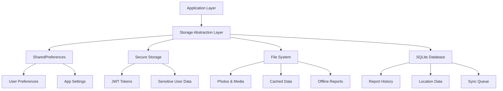
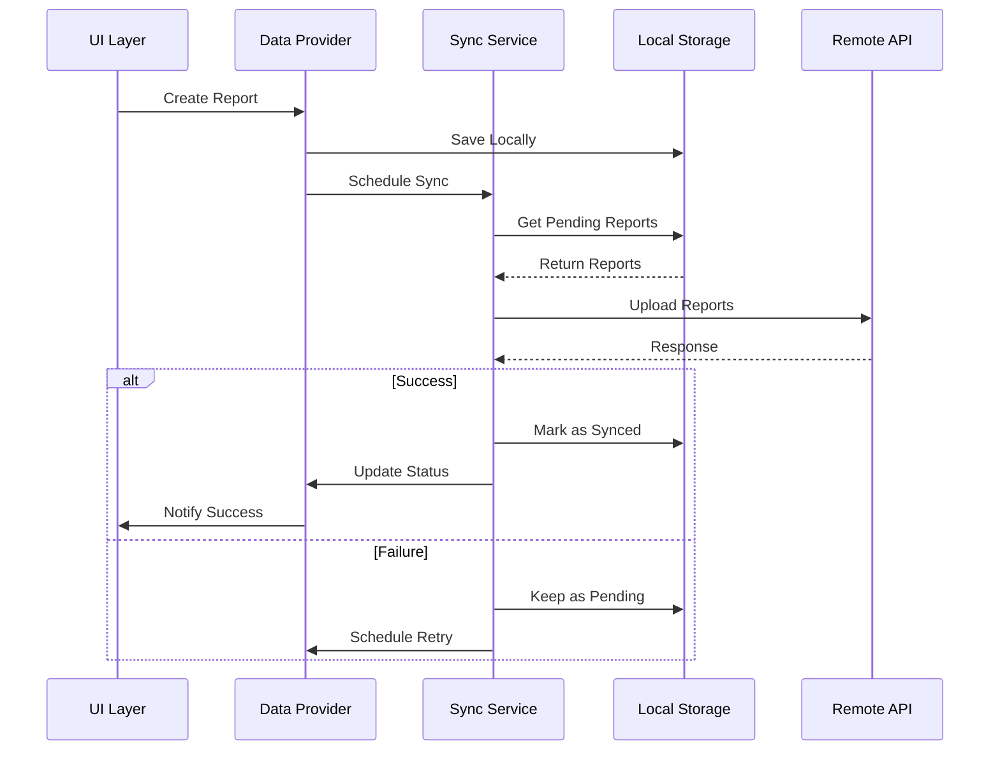

# Data Management

## 🗃️ Data Architecture Overview

The Mosquito Alert app implements a robust data management system that handles both online and offline scenarios, ensuring data integrity and optimal user experience regardless of network connectivity.

## 📊 Data Models & Structures

### Core Data Models

#### User Model
```dart
class User {
  final String id;
  final String email;
  final String? displayName;
  final String? avatarUrl;
  final DateTime createdAt;
  final UserPreferences preferences;
  final UserStatistics statistics;
  
  User({
    required this.id,
    required this.email,
    this.displayName,
    this.avatarUrl,
    required this.createdAt,
    required this.preferences,
    required this.statistics,
  });
  
  factory User.fromJson(Map<String, dynamic> json) {
    return User(
      id: json['id'] as String,
      email: json['email'] as String,
      displayName: json['display_name'] as String?,
      avatarUrl: json['avatar_url'] as String?,
      createdAt: DateTime.parse(json['created_at'] as String),
      preferences: UserPreferences.fromJson(json['preferences']),
      statistics: UserStatistics.fromJson(json['statistics']),
    );
  }
  
  Map<String, dynamic> toJson() {
    return {
      'id': id,
      'email': email,
      'display_name': displayName,
      'avatar_url': avatarUrl,
      'created_at': createdAt.toIso8601String(),
      'preferences': preferences.toJson(),
      'statistics': statistics.toJson(),
    };
  }
}
```

#### Report Model
```dart
enum ReportType { mosquito, breedingSite }
enum ReportStatus { draft, pending, synced, failed }

class Report {
  final String id;
  final String userId;
  final ReportType type;
  final double latitude;
  final double longitude;
  final String? locationName;
  final List<String> imagePaths;
  final String? notes;
  final DateTime createdAt;
  final DateTime? submittedAt;
  final ReportStatus status;
  final Map<String, dynamic>? metadata;
  
  Report({
    required this.id,
    required this.userId,
    required this.type,
    required this.latitude,
    required this.longitude,
    this.locationName,
    required this.imagePaths,
    this.notes,
    required this.createdAt,
    this.submittedAt,
    required this.status,
    this.metadata,
  });
  
  // JSON serialization methods
  factory Report.fromJson(Map<String, dynamic> json) { /* ... */ }
  Map<String, dynamic> toJson() { /* ... */ }
  
  // Helper methods
  bool get isPending => status == ReportStatus.pending;
  bool get isSynced => status == ReportStatus.synced;
  bool get hasImages => imagePaths.isNotEmpty;
  
  Report copyWith({
    ReportStatus? status,
    DateTime? submittedAt,
    // ... other parameters
  }) {
    return Report(
      id: id,
      userId: userId,
      type: type,
      latitude: latitude,
      longitude: longitude,
      locationName: locationName,
      imagePaths: imagePaths,
      notes: notes,
      createdAt: createdAt,
      submittedAt: submittedAt ?? this.submittedAt,
      status: status ?? this.status,
      metadata: metadata,
    );
  }
}
```

#### Mosquito-Specific Model
```dart
class MosquitoReport extends Report {
  final String? species;
  final String? certaintyLevel;
  final String? biteLocation;
  final bool wasAlive;
  final String? captureMethod;
  
  MosquitoReport({
    required String id,
    required String userId,
    required double latitude,
    required double longitude,
    required List<String> imagePaths,
    required DateTime createdAt,
    required ReportStatus status,
    this.species,
    this.certaintyLevel,
    this.biteLocation,
    required this.wasAlive,
    this.captureMethod,
    String? locationName,
    String? notes,
    DateTime? submittedAt,
    Map<String, dynamic>? metadata,
  }) : super(
         id: id,
         userId: userId,
         type: ReportType.mosquito,
         latitude: latitude,
         longitude: longitude,
         locationName: locationName,
         imagePaths: imagePaths,
         notes: notes,
         createdAt: createdAt,
         submittedAt: submittedAt,
         status: status,
         metadata: metadata,
       );
}
```

## 💾 Local Storage Strategy

### Storage Layers



### Storage Implementation

#### Preferences Storage
```dart
class PreferencesStorage {
  static const String KEY_USER_ID = 'user_id';
  static const String KEY_LANGUAGE = 'language';
  static const String KEY_NOTIFICATIONS_ENABLED = 'notifications_enabled';
  static const String KEY_FIRST_LAUNCH = 'first_launch';
  
  static Future<void> setUserId(String userId) async {
    final prefs = await SharedPreferences.getInstance();
    await prefs.setString(KEY_USER_ID, userId);
  }
  
  static Future<String?> getUserId() async {
    final prefs = await SharedPreferences.getInstance();
    return prefs.getString(KEY_USER_ID);
  }
  
  static Future<void> setLanguage(String languageCode) async {
    final prefs = await SharedPreferences.getInstance();
    await prefs.setString(KEY_LANGUAGE, languageCode);
  }
  
  static Future<String> getLanguage() async {
    final prefs = await SharedPreferences.getInstance();
    return prefs.getString(KEY_LANGUAGE) ?? 'en';
  }
}
```

#### Secure Storage
```dart
class SecureStorage {
  static const FlutterSecureStorage _storage = FlutterSecureStorage(
    aOptions: AndroidOptions(
      encryptedSharedPreferences: true,
    ),
    iOptions: IOSOptions(
      accessibility: IOSAccessibility.first_unlock_this_device,
    ),
  );
  
  static const String KEY_JWT_TOKEN = 'jwt_token';
  static const String KEY_REFRESH_TOKEN = 'refresh_token';
  
  static Future<void> storeAuthTokens({
    required String accessToken,
    required String refreshToken,
  }) async {
    await Future.wait([
      _storage.write(key: KEY_JWT_TOKEN, value: accessToken),
      _storage.write(key: KEY_REFRESH_TOKEN, value: refreshToken),
    ]);
  }
  
  static Future<String?> getAccessToken() async {
    return await _storage.read(key: KEY_JWT_TOKEN);
  }
  
  static Future<void> clearAuthTokens() async {
    await Future.wait([
      _storage.delete(key: KEY_JWT_TOKEN),
      _storage.delete(key: KEY_REFRESH_TOKEN),
    ]);
  }
}
```

#### File System Storage
```dart
class FileStorage {
  static Future<String> get _localPath async {
    final directory = await getApplicationDocumentsDirectory();
    return directory.path;
  }
  
  static Future<Directory> get _reportsDirectory async {
    final path = await _localPath;
    final directory = Directory('$path/reports');
    if (!await directory.exists()) {
      await directory.create(recursive: true);
    }
    return directory;
  }
  
  static Future<File> saveReportImage(String reportId, Uint8List imageBytes) async {
    final directory = await _reportsDirectory;
    final fileName = '${reportId}_${DateTime.now().millisecondsSinceEpoch}.jpg';
    final file = File('${directory.path}/$fileName');
    return await file.writeAsBytes(imageBytes);
  }
  
  static Future<void> saveReportJson(Report report) async {
    final directory = await _reportsDirectory;
    final file = File('${directory.path}/${report.id}.json');
    await file.writeAsString(jsonEncode(report.toJson()));
  }
  
  static Future<List<Report>> loadLocalReports() async {
    final directory = await _reportsDirectory;
    final files = directory.listSync()
        .where((entity) => entity.path.endsWith('.json'))
        .cast<File>();
    
    final reports = <Report>[];
    for (final file in files) {
      try {
        final jsonString = await file.readAsString();
        final json = jsonDecode(jsonString);
        reports.add(Report.fromJson(json));
      } catch (e) {
        print('Error loading report from ${file.path}: $e');
      }
    }
    
    return reports;
  }
}
```

## 🔄 Data Synchronization

### Sync Strategy



### Sync Service Implementation

```dart
class SyncService {
  static const String SYNC_TASK_ID = 'mosquito_alert_sync';
  static const Duration SYNC_INTERVAL = Duration(hours: 1);
  static const Duration RETRY_DELAY = Duration(minutes: 15);
  
  static void initialize() {
    Workmanager().initialize(callbackDispatcher, isInDebugMode: false);
  }
  
  static Future<void> schedulePeriodicSync() async {
    await Workmanager().registerPeriodicTask(
      SYNC_TASK_ID,
      'periodicSync',
      frequency: SYNC_INTERVAL,
      constraints: Constraints(
        networkType: NetworkType.connected,
        requiresBatteryNotLow: true,
      ),
    );
  }
  
  static Future<void> scheduleImmediateSync() async {
    await Workmanager().registerOneOffTask(
      '${SYNC_TASK_ID}_immediate',
      'immediateSync',
      constraints: Constraints(
        networkType: NetworkType.connected,
      ),
    );
  }
  
  static Future<bool> performSync() async {
    try {
      final pendingReports = await FileStorage.loadLocalReports()
          .then((reports) => reports.where((r) => r.isPending).toList());
      
      if (pendingReports.isEmpty) return true;
      
      final results = await Future.wait(
        pendingReports.map((report) => _syncReport(report)),
      );
      
      return results.every((success) => success);
    } catch (e) {
      print('Sync failed: $e');
      return false;
    }
  }
  
  static Future<bool> _syncReport(Report report) async {
    try {
      // Upload images first
      final uploadedImageUrls = <String>[];
      for (final imagePath in report.imagePaths) {
        final imageUrl = await ApiClient.uploadImage(File(imagePath));
        uploadedImageUrls.add(imageUrl);
      }
      
      // Create report with uploaded image URLs
      final updatedReport = report.copyWith(
        metadata: {
          ...?report.metadata,
          'uploaded_images': uploadedImageUrls,
        },
      );
      
      // Submit report to API
      await ApiClient.createReport(updatedReport);
      
      // Update local status
      final syncedReport = updatedReport.copyWith(
        status: ReportStatus.synced,
        submittedAt: DateTime.now(),
      );
      
      await FileStorage.saveReportJson(syncedReport);
      return true;
    } catch (e) {
      print('Failed to sync report ${report.id}: $e');
      return false;
    }
  }
}

@pragma('vm:entry-point')
void callbackDispatcher() {
  Workmanager().executeTask((task, inputData) async {
    switch (task) {
      case 'periodicSync':
      case 'immediateSync':
        return await SyncService.performSync();
      default:
        return false;
    }
  });
}
```

## 📱 State Management Integration

### Data Provider Pattern

```dart
class ReportDataProvider with ChangeNotifier {
  List<Report> _reports = [];
  bool _isLoading = false;
  String? _error;
  
  List<Report> get reports => List.unmodifiable(_reports);
  bool get isLoading => _isLoading;
  String? get error => _error;
  
  List<Report> get pendingReports => 
      _reports.where((report) => report.isPending).toList();
  
  List<Report> get syncedReports => 
      _reports.where((report) => report.isSynced).toList();
  
  Future<void> loadReports() async {
    _setLoading(true);
    try {
      _reports = await FileStorage.loadLocalReports();
      _error = null;
    } catch (e) {
      _error = 'Failed to load reports: $e';
    } finally {
      _setLoading(false);
    }
  }
  
  Future<void> createReport(Report report) async {
    try {
      // Save locally first
      await FileStorage.saveReportJson(report);
      _reports.add(report);
      notifyListeners();
      
      // Schedule sync
      await SyncService.scheduleImmediateSync();
    } catch (e) {
      _error = 'Failed to create report: $e';
      notifyListeners();
    }
  }
  
  Future<void> updateReportStatus(String reportId, ReportStatus status) async {
    final index = _reports.indexWhere((report) => report.id == reportId);
    if (index != -1) {
      _reports[index] = _reports[index].copyWith(status: status);
      await FileStorage.saveReportJson(_reports[index]);
      notifyListeners();
    }
  }
  
  void _setLoading(bool loading) {
    _isLoading = loading;
    notifyListeners();
  }
}
```

## 🧹 Data Cleanup & Maintenance

### Cache Management

```dart
class CacheManager {
  static const Duration MAX_CACHE_AGE = Duration(days: 7);
  static const int MAX_CACHED_IMAGES = 100;
  
  static Future<void> cleanupOldData() async {
    await Future.wait([
      _cleanupOldImages(),
      _cleanupOldReports(),
      _cleanupOldCacheFiles(),
    ]);
  }
  
  static Future<void> _cleanupOldImages() async {
    final directory = await FileStorage._reportsDirectory;
    final now = DateTime.now();
    
    final imageFiles = directory.listSync()
        .where((entity) => entity.path.endsWith('.jpg'))
        .cast<File>();
    
    final oldFiles = <File>[];
    for (final file in imageFiles) {
      final stat = await file.stat();
      if (now.difference(stat.modified) > MAX_CACHE_AGE) {
        oldFiles.add(file);
      }
    }
    
    // Keep only recent files, delete excess
    if (oldFiles.length > MAX_CACHED_IMAGES) {
      oldFiles.sort((a, b) => a.lastModifiedSync().compareTo(b.lastModifiedSync()));
      final filesToDelete = oldFiles.take(oldFiles.length - MAX_CACHED_IMAGES);
      
      for (final file in filesToDelete) {
        try {
          await file.delete();
        } catch (e) {
          print('Failed to delete old image: $e');
        }
      }
    }
  }
  
  static Future<void> _cleanupOldReports() async {
    final reports = await FileStorage.loadLocalReports();
    final now = DateTime.now();
    
    // Remove synced reports older than cache age
    final reportsToKeep = reports.where((report) {
      if (report.isSynced) {
        return now.difference(report.createdAt) <= MAX_CACHE_AGE;
      }
      return true; // Keep all pending reports
    }).toList();
    
    if (reportsToKeep.length != reports.length) {
      // Save updated report list
      final directory = await FileStorage._reportsDirectory;
      
      // Delete all report files
      final files = directory.listSync().cast<File>();
      for (final file in files) {
        await file.delete();
      }
      
      // Re-save kept reports
      for (final report in reportsToKeep) {
        await FileStorage.saveReportJson(report);
      }
    }
  }
}
```

## 📊 Data Analytics & Metrics

### Usage Tracking

```dart
class DataMetrics {
  static Future<Map<String, dynamic>> getStorageMetrics() async {
    final directory = await FileStorage._reportsDirectory;
    final files = directory.listSync();
    
    int totalFiles = files.length;
    int totalSize = 0;
    int imageCount = 0;
    int reportCount = 0;
    
    for (final file in files.cast<File>()) {
      final stat = await file.stat();
      totalSize += stat.size;
      
      if (file.path.endsWith('.jpg')) {
        imageCount++;
      } else if (file.path.endsWith('.json')) {
        reportCount++;
      }
    }
    
    return {
      'total_files': totalFiles,
      'total_size_bytes': totalSize,
      'image_count': imageCount,
      'report_count': reportCount,
      'avg_file_size': totalFiles > 0 ? totalSize / totalFiles : 0,
    };
  }
  
  static Future<Map<String, dynamic>> getSyncMetrics() async {
    final reports = await FileStorage.loadLocalReports();
    
    final pendingCount = reports.where((r) => r.isPending).length;
    final syncedCount = reports.where((r) => r.isSynced).length;
    final failedCount = reports.where((r) => r.status == ReportStatus.failed).length;
    
    return {
      'total_reports': reports.length,
      'pending_reports': pendingCount,
      'synced_reports': syncedCount,
      'failed_reports': failedCount,
      'sync_success_rate': reports.isNotEmpty 
          ? syncedCount / reports.length 
          : 0.0,
    };
  }
}
