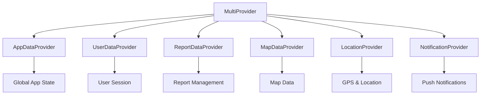

# State Management

## 🔧 Provider Pattern Implementation

The Mosquito Alert app uses the Provider pattern for state management, offering a reactive and scalable approach to managing application state. This pattern separates business logic from UI components and provides a clean way to share data across the widget tree.

## 🏗️ Provider Architecture

### State Management Hierarchy



### Main Provider Setup

```dart
// main.dart
void main() async {
  WidgetsFlutterBinding.ensureInitialized();
  
  // Initialize services
  await Firebase.initializeApp();
  await SyncService.initialize();
  
  runApp(
    MultiProvider(
      providers: [
        ChangeNotifierProvider(create: (_) => AppDataProvider()),
        ChangeNotifierProvider(create: (_) => UserDataProvider()),
        ChangeNotifierProvider(create: (_) => ReportDataProvider()),
        ChangeNotifierProvider(create: (_) => MapDataProvider()),
        ChangeNotifierProvider(create: (_) => LocationProvider()),
        ChangeNotifierProvider(create: (_) => NotificationProvider()),
      ],
      child: MosquitoAlertApp(),
    ),
  );
}
```

## 📱 Core Providers

### 1. AppDataProvider - Global Application State

```dart
class AppDataProvider with ChangeNotifier {
  // App initialization state
  bool _isInitialized = false;
  bool _isLoading = false;
  String? _error;
  
  // App configuration
  String _currentLanguage = 'en';
  bool _isDarkMode = false;
  bool _isFirstLaunch = true;
  
  // Network state
  bool _isOnline = true;
  
  // Getters
  bool get isInitialized => _isInitialized;
  bool get isLoading => _isLoading;
  String? get error => _error;
  String get currentLanguage => _currentLanguage;
  bool get isDarkMode => _isDarkMode;
  bool get isFirstLaunch => _isFirstLaunch;
  bool get isOnline => _isOnline;
  
  // Initialization
  Future<void> initialize() async {
    _setLoading(true);
    
    try {
      // Load saved preferences
      await _loadPreferences();
      
      // Initialize services
      await _initializeServices();
      
      // Check network connectivity
      await _checkConnectivity();
      
      _isInitialized = true;
      _error = null;
    } catch (e) {
      _error = 'Failed to initialize app: $e';
      print('App initialization error: $e');
    } finally {
      _setLoading(false);
    }
  }
  
  Future<void> _loadPreferences() async {
    final prefs = await SharedPreferences.getInstance();
    
    _currentLanguage = prefs.getString('language') ?? 'en';
    _isDarkMode = prefs.getBool('dark_mode') ?? false;
    _isFirstLaunch = prefs.getBool('first_launch') ?? true;
    
    notifyListeners();
  }
  
  Future<void> _initializeServices() async {
    await Future.wait([
      LocationService.initialize(),
      NotificationService.initialize(),
      ConnectivityService().initialize(),
    ]);
  }
  
  Future<void> _checkConnectivity() async {
    _isOnline = await ConnectivityService().isOnline;
    
    // Listen to connectivity changes
    ConnectivityService().onConnectivityChanged.listen((isOnline) {
      if (_isOnline != isOnline) {
        _isOnline = isOnline;
        notifyListeners();
      }
    });
  }
  
  // App settings methods
  Future<void> setLanguage(String languageCode) async {
    if (_currentLanguage != languageCode) {
      _currentLanguage = languageCode;
      
      final prefs = await SharedPreferences.getInstance();
      await prefs.setString('language', languageCode);
      
      notifyListeners();
    }
  }
  
  Future<void> setDarkMode(bool enabled) async {
    if (_isDarkMode != enabled) {
      _isDarkMode = enabled;
      
      final prefs = await SharedPreferences.getInstance();
      await prefs.setBool('dark_mode', enabled);
      
      notifyListeners();
    }
  }
  
  Future<void> completeOnboarding() async {
    _isFirstLaunch = false;
    
    final prefs = await SharedPreferences.getInstance();
    await prefs.setBool('first_launch', false);
    
    notifyListeners();
  }
  
  void _setLoading(bool loading) {
    _isLoading = loading;
    notifyListeners();
  }
  
  void clearError() {
    _error = null;
    notifyListeners();
  }
}
```

### 2. UserDataProvider - User Session Management

```dart
class UserDataProvider with ChangeNotifier {
  User? _currentUser;
  bool _isAuthenticated = false;
  bool _isLoading = false;
  String? _error;
  
  // User statistics
  int _totalReports = 0;
  int _totalPoints = 0;
  List<Achievement> _achievements = [];
  
  // Getters
  User? get currentUser => _currentUser;
  bool get isAuthenticated => _isAuthenticated;
  bool get isLoading => _isLoading;
  String? get error => _error;
  int get totalReports => _totalReports;
  int get totalPoints => _totalPoints;
  List<Achievement> get achievements => List.unmodifiable(_achievements);
  
  // Authentication methods
  Future<void> checkAuthenticationStatus() async {
    _setLoading(true);
    
    try {
      final token = await SecureStorage.getAccessToken();
      if (token != null) {
        await _loadUserProfile();
      }
    } catch (e) {
      print('Auth check failed: $e');
      await logout();
    } finally {
      _setLoading(false);
    }
  }
  
  Future<void> login({
    required String email,
    required String password,
  }) async {
    _setLoading(true);
    _clearError();
    
    try {
      final user = await AuthService.login(
        email: email,
        password: password,
      );
      
      _currentUser = user;
      _isAuthenticated = true;
      
      // Load additional user data
      await _loadUserStatistics();
      
      // Save user ID for offline access
      await PreferencesStorage.setUserId(user.id);
      
    } catch (e) {
      _error = e.toString();
      _isAuthenticated = false;
    } finally {
      _setLoading(false);
    }
  }
  
  Future<void> register({
    required String email,
    required String password,
    String? displayName,
  }) async {
    _setLoading(true);
    _clearError();
    
    try {
      final user = await AuthService.register(
        email: email,
        password: password,
        displayName: displayName,
      );
      
      _currentUser = user;
      _isAuthenticated = true;
      
      await PreferencesStorage.setUserId(user.id);
      
    } catch (e) {
      _error = e.toString();
      _isAuthenticated = false;
    } finally {
      _setLoading(false);
    }
  }
  
  Future<void> logout() async {
    try {
      await AuthService.logout();
    } catch (e) {
      print('Logout error: $e');
    } finally {
      _currentUser = null;
      _isAuthenticated = false;
      _totalReports = 0;
      _totalPoints = 0;
      _achievements.clear();
      
      await PreferencesStorage.clearUserId();
      notifyListeners();
    }
  }
  
  Future<void> _loadUserProfile() async {
    try {
      final response = await ApiClient.instance.dio.get('/user/profile');
      _currentUser = User.fromJson(response.data);
      _isAuthenticated = true;
      
      await _loadUserStatistics();
    } catch (e) {
      throw Exception('Failed to load user profile: $e');
    }
  }
  
  Future<void> _loadUserStatistics() async {
    try {
      final response = await ApiClient.instance.dio.get('/user/statistics');
      final data = response.data;
      
      _totalReports = data['total_reports'] ?? 0;
      _totalPoints = data['total_points'] ?? 0;
      
      if (data['achievements'] != null) {
        _achievements = (data['achievements'] as List)
            .map((json) => Achievement.fromJson(json))
            .toList();
      }
    } catch (e) {
      print('Failed to load user statistics: $e');
    }
  }
  
  Future<void> updateProfile({
    String? displayName,
    String? email,
  }) async {
    if (_currentUser == null) return;
    
    _setLoading(true);
    _clearError();
    
    try {
      final response = await ApiClient.instance.dio.put(
        '/user/profile',
        data: {
          'display_name': displayName,
          'email': email,
        },
      );
      
      _currentUser = User.fromJson(response.data);
      
    } catch (e) {
      _error = 'Failed to update profile: $e';
    } finally {
      _setLoading(false);
    }
  }
  
  void _setLoading(bool loading) {
    _isLoading = loading;
    notifyListeners();
  }
  
  void _clearError() {
    _error = null;
    notifyListeners();
  }
  
  void addReportToStatistics() {
    _totalReports++;
    _totalPoints += 10; // Base points for a report
    notifyListeners();
  }
}
```

### 3. ReportDataProvider - Report Management

```dart
class ReportDataProvider with ChangeNotifier {
  List<Report> _reports = [];
  List<Report> _draftReports = [];
  bool _isLoading = false;
  String? _error;
  
  // Current report being created
  Report? _currentDraft;
  
  // Getters
  List<Report> get reports => List.unmodifiable(_reports);
  List<Report> get draftReports => List.unmodifiable(_draftReports);
  List<Report> get pendingReports => 
      _reports.where((r) => r.status == ReportStatus.pending).toList();
  List<Report> get syncedReports => 
      _reports.where((r) => r.status == ReportStatus.synced).toList();
  bool get isLoading => _isLoading;
  String? get error => _error;
  Report? get currentDraft => _currentDraft;
  
  int get totalReports => _reports.length;
  int get pendingCount => pendingReports.length;
  
  // Initialization
  Future<void> initialize() async {
    await loadReports();
    await loadDraftReports();
  }
  
  Future<void> loadReports() async {
    _setLoading(true);
    
    try {
      // Load from local storage first
      _reports = await FileStorage.loadLocalReports();
      
      // Try to sync with server if online
      if (ConnectivityService().isOnline) {
        await _syncWithServer();
      }
      
      _error = null;
    } catch (e) {
      _error = 'Failed to load reports: $e';
      print('Load reports error: $e');
    } finally {
      _setLoading(false);
    }
  }
  
  Future<void> loadDraftReports() async {
    try {
      _draftReports = await FileStorage.loadDraftReports();
      notifyListeners();
    } catch (e) {
      print('Failed to load draft reports: $e');
    }
  }
  
  // Report creation flow
  void startNewReport(ReportType type) {
    _currentDraft = Report(
      id: _generateReportId(),
      userId: _getCurrentUserId(),
      type: type,
      latitude: 0.0, // Will be updated with GPS
      longitude: 0.0,
      imagePaths: [],
      createdAt: DateTime.now(),
      status: ReportStatus.draft,
    );
    notifyListeners();
  }
  
  void updateDraftLocation(double latitude, double longitude, String? locationName) {
    if (_currentDraft != null) {
      _currentDraft = _currentDraft!.copyWith(
        latitude: latitude,
        longitude: longitude,
        locationName: locationName,
      );
      notifyListeners();
    }
  }
  
  Future<void> addImageToDraft(String imagePath) async {
    if (_currentDraft != null) {
      final updatedPaths = List<String>.from(_currentDraft!.imagePaths)
        ..add(imagePath);
      
      _currentDraft = _currentDraft!.copyWith(imagePaths: updatedPaths);
      
      // Save draft automatically
      await saveDraft();
      notifyListeners();
    }
  }
  
  void updateDraftNotes(String notes) {
    if (_currentDraft != null) {
      _currentDraft = _currentDraft!.copyWith(notes: notes);
      notifyListeners();
    }
  }
  
  Future<void> saveDraft() async {
    if (_currentDraft != null) {
      try {
        await FileStorage.saveDraftReport(_currentDraft!);
        
        // Add to drafts list if not already there
        final existingIndex = _draftReports.indexWhere(
          (draft) => draft.id == _currentDraft!.id,
        );
        
        if (existingIndex >= 0) {
          _draftReports[existingIndex] = _currentDraft!;
        } else {
          _draftReports.add(_currentDraft!);
        }
        
        notifyListeners();
      } catch (e) {
        print('Failed to save draft: $e');
      }
    }
  }
  
  Future<void> submitReport([Report? report]) async {
    final reportToSubmit = report ?? _currentDraft;
    if (reportToSubmit == null) return;
    
    _setLoading(true);
    _clearError();
    
    try {
      // Validate report
      _validateReport(reportToSubmit);
      
      // Update status and timestamp
      final submittedReport = reportToSubmit.copyWith(
        status: ReportStatus.pending,
        submittedAt: DateTime.now(),
      );
      
      // Save locally
      await FileStorage.saveReportJson(submittedReport);
      
      // Add to reports list
      _reports.add(submittedReport);
      
      // Remove from drafts if it was a draft
      _draftReports.removeWhere((draft) => draft.id == submittedReport.id);
      await FileStorage.deleteDraftReport(submittedReport.id);
      
      // Clear current draft
      _currentDraft = null;
      
      // Schedule sync
      await SyncService.scheduleImmediateSync();
      
      // Update user statistics
      context.read<UserDataProvider>().addReportToStatistics();
      
      notifyListeners();
      
    } catch (e) {
      _error = 'Failed to submit report: $e';
    } finally {
      _setLoading(false);
    }
  }
  
  Future<void> deleteReport(String reportId) async {
    try {
      _reports.removeWhere((report) => report.id == reportId);
      await FileStorage.deleteReport(reportId);
      notifyListeners();
    } catch (e) {
      _error = 'Failed to delete report: $e';
      notifyListeners();
    }
  }
  
  Future<void> deleteDraft(String draftId) async {
    try {
      _draftReports.removeWhere((draft) => draft.id == draftId);
      await FileStorage.deleteDraftReport(draftId);
      
      if (_currentDraft?.id == draftId) {
        _currentDraft = null;
      }
      
      notifyListeners();
    } catch (e) {
      print('Failed to delete draft: $e');
    }
  }
  
  void clearCurrentDraft() {
    _currentDraft = null;
    notifyListeners();
  }
  
  Future<void> retryFailedReports() async {
    final failedReports = _reports
        .where((r) => r.status == ReportStatus.failed)
        .toList();
    
    for (final report in failedReports) {
      final retryReport = report.copyWith(status: ReportStatus.pending);
      await updateReportStatus(report.id, ReportStatus.pending);
    }
    
    await SyncService.scheduleImmediateSync();
  }
  
  Future<void> updateReportStatus(String reportId, ReportStatus status) async {
    final index = _reports.indexWhere((report) => report.id == reportId);
    if (index >= 0) {
      _reports[index] = _reports[index].copyWith(status: status);
      await FileStorage.saveReportJson(_reports[index]);
      notifyListeners();
    }
  }
  
  Future<void> _syncWithServer() async {
    try {
      // This would typically fetch recent reports from server
      // and merge with local data
      final serverReports = await ReportApiService.getUserReports();
      
      // Merge logic here...
      // Update synced reports, keep pending ones
      
    } catch (e) {
      print('Server sync failed: $e');
    }
  }
  
  void _validateReport(Report report) {
    if (report.imagePaths.isEmpty) {
      throw ValidationException('At least one photo is required');
    }
    
    if (report.latitude == 0.0 && report.longitude == 0.0) {
      throw ValidationException('Location is required');
    }
  }
  
  String _generateReportId() {
    return '${DateTime.now().millisecondsSinceEpoch}_${Random().nextInt(1000)}';
  }
  
  String _getCurrentUserId() {
    // Get from UserDataProvider or stored preferences
    return context.read<UserDataProvider>().currentUser?.id ?? 'anonymous';
  }
  
  void _setLoading(bool loading) {
    _isLoading = loading;
    notifyListeners();
  }
  
  void _clearError() {
    _error = null;
    notifyListeners();
  }
}
```

## 🗺️ MapDataProvider - Map State Management

```dart
class MapDataProvider with ChangeNotifier {
  // Map state
  LatLng? _userLocation;
  LatLng? _mapCenter;
  double _zoomLevel = 12.0;
  
  // Report data on map
  List<MapReport> _mapReports = [];
  bool _isLoadingMapData = false;
  String? _mapError;
  
  // Filters
  DateTime? _startDate;
  DateTime? _endDate;
  ReportType? _selectedType;
  double _radiusKm = 10.0;
  
  // Getters
  LatLng? get userLocation => _userLocation;
  LatLng? get mapCenter => _mapCenter;
  double get zoomLevel => _zoomLevel;
  List<MapReport> get mapReports => List.unmodifiable(_mapReports);
  bool get isLoadingMapData => _isLoadingMapData;
  String? get mapError => _mapError;
  
  DateTime? get startDate => _startDate;
  DateTime? get endDate => _endDate;
  ReportType? get selectedType => _selectedType;
  double get radiusKm => _radiusKm;
  
  // Map control methods
  void updateUserLocation(LatLng location) {
    _userLocation = location;
    _mapCenter ??= location; // Set as center if not set
    notifyListeners();
  }
  
  void updateMapCenter(LatLng center) {
    _mapCenter = center;
    notifyListeners();
  }
  
  void updateZoomLevel(double zoom) {
    _zoomLevel = zoom;
    notifyListeners();
  }
  
  // Data loading
  Future<void> loadMapReports() async {
    if (_mapCenter == null) return;
    
    _isLoadingMapData = true;
    _mapError = null;
    notifyListeners();
    
    try {
      _mapReports = await MapApiService.getMapReports(
        centerLat: _mapCenter!.latitude,
        centerLng: _mapCenter!.longitude,
        radiusKm: _radiusKm,
        startDate: _startDate,
        endDate: _endDate,
        type: _selectedType,
      );
    } catch (e) {
      _mapError = 'Failed to load map data: $e';
    } finally {
      _isLoadingMapData = false;
      notifyListeners();
    }
  }
  
  // Filter methods
  void setDateFilter(DateTime? start, DateTime? end) {
    _startDate = start;
    _endDate = end;
    notifyListeners();
    loadMapReports();
  }
  
  void setTypeFilter(ReportType? type) {
    _selectedType = type;
    notifyListeners();
    loadMapReports();
  }
  
  void setRadiusFilter(double radius) {
    _radiusKm = radius;
    notifyListeners();
    loadMapReports();
  }
  
  void clearFilters() {
    _startDate = null;
    _endDate = null;
    _selectedType = null;
    _radiusKm = 10.0;
    notifyListeners();
    loadMapReports();
  }
  
  // Helper methods
  List<MapReport> getReportsInBounds(LatLngBounds bounds) {
    return _mapReports.where((report) {
      final position = LatLng(report.latitude, report.longitude);
      return bounds.contains(position);
    }).toList();
  }
  
  MapReport? getReportById(String id) {
    try {
      return _mapReports.firstWhere((report) => report.id == id);
    } catch (e) {
      return null;
    }
  }
}
```

## 🔔 Consumer Widgets Usage

### Basic Consumer Usage

```dart
class ReportListScreen extends StatelessWidget {
  @override
  Widget build(BuildContext context) {
    return Scaffold(
      appBar: AppBar(title: Text('My Reports')),
      body: Consumer<ReportDataProvider>(
        builder: (context, reportProvider, child) {
          if (reportProvider.isLoading) {
            return Center(child: CircularProgressIndicator());
          }
          
          if (reportProvider.error != null) {
            return Center(
              child: Column(
                mainAxisAlignment: MainAxisAlignment.center,
                children: [
                  Text('Error: ${reportProvider.error}'),
                  ElevatedButton(
                    onPressed: () => reportProvider.loadReports(),
                    child: Text('Retry'),
                  ),
                ],
              ),
            );
          }
          
          final reports = reportProvider.reports;
          
          if (reports.isEmpty) {
            return Center(
              child: Text('No reports yet. Create your first report!'),
            );
          }
          
          return ListView.builder(
            itemCount: reports.length,
            itemBuilder: (context, index) {
              final report = reports[index];
              return ReportListTile(report: report);
            },
          );
        },
      ),
      floatingActionButton: FloatingActionButton(
        onPressed: () => _startNewReport(context),
        child: Icon(Icons.add),
      ),
    );
  }
  
  void _startNewReport(BuildContext context) {
    final reportProvider = Provider.of<ReportDataProvider>(context, listen: false);
    reportProvider.startNewReport(ReportType.mosquito);
    
    Navigator.push(
      context,
      MaterialPageRoute(builder: (context) => CameraScreen()),
    );
  }
}
```

### Multi-Provider Consumer

```dart
class HomeScreen extends StatelessWidget {
  @override
  Widget build(BuildContext context) {
    return Scaffold(
      body: Consumer3<UserDataProvider, ReportDataProvider, AppDataProvider>(
        builder: (context, userProvider, reportProvider, appProvider, child) {
          if (!appProvider.isInitialized) {
            return SplashScreen();
          }
          
          if (!userProvider.isAuthenticated) {
            return LoginScreen();
          }
          
          return Column(
            children: [
              // User greeting
              Padding(
                padding: EdgeInsets.all(16),
                child: Text(
                  'Hello, ${userProvider.currentUser?.displayName ?? 'User'}!',
                  style: Theme.of(context).textTheme.headlineSmall,
                ),
              ),
              
              // Statistics cards
              Row(
                children: [
                  Expanded(
                    child: StatCard(
                      title: 'Total Reports',
                      value: '${reportProvider.totalReports}',
                      icon: Icons.report,
                    ),
                  ),
                  Expanded(
                    child: StatCard(
                      title: 'Points',
                      value: '${userProvider.totalPoints}',
                      icon: Icons.star,
                    ),
                  ),
                ],
              ),
              
              // Quick actions
              Expanded(
                child: QuickActionsGrid(),
              ),
            ],
          );
        },
      ),
    );
  }
}
```

### Selector for Performance Optimization

```dart
class ReportCounter extends StatelessWidget {
  @override
  Widget build(BuildContext context) {
    // Only rebuilds when totalReports changes
    return Selector<ReportDataProvider, int>(
      selector: (context, provider) => provider.totalReports,
      builder: (context, totalReports, child) {
        return Container(
          padding: EdgeInsets.all(8),
          decoration: BoxDecoration(
            color: Colors.blue,
            borderRadius: BorderRadius.circular(16),
          ),
          child: Text(
            '$totalReports',
            style: TextStyle(
              color: Colors.white,
              fontWeight: FontWeight.bold,
            ),
          ),
        );
      },
    );
  }
}
```

## 🔄 State Persistence

### Automatic State Saving

```dart
extension ReportDataProviderPersistence on ReportDataProvider {
  Future<void> saveState() async {
    final prefs = await SharedPreferences.getInstance();
    
    // Save basic state information
    await prefs.setInt('total_reports', totalReports);
    await prefs.setInt('pending_reports', pendingCount);
    
    // Save current draft if exists
    if (_currentDraft != null) {
      await prefs.setString('current_draft', jsonEncode(_currentDraft!.toJson()));
    }
  }
  
  Future<void> restoreState() async {
    final prefs = await SharedPreferences.getInstance();
    
    // Restore current draft
    final draftJson = prefs.getString('current_draft');
    if (draftJson != null) {
      try {
        final draftData = jsonDecode(draftJson);
        _currentDraft = Report.fromJson(draftData);
        notifyListeners();
      } catch (e) {
        print('Failed to restore draft: $e');
      }
    }
  }
}
```

This state management system provides a robust foundation for the Mosquito Alert app, ensuring data consistency, offline functionality, and a responsive user interface.
