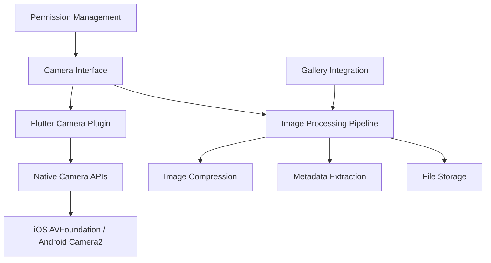

# Camera & Media Management

## 📸 Camera System Overview

The Mosquito Alert app implements a sophisticated camera system that provides a WhatsApp-style interface for capturing photos, with automatic compression, metadata extraction, and seamless integration with the reporting workflow.

## 🏗️ Camera Architecture

### Camera Implementation Stack



### Camera Controller Setup

```dart
class CameraService {
  static CameraService? _instance;
  static CameraService get instance => _instance ??= CameraService._internal();
  CameraService._internal();
  
  CameraController? _controller;
  List<CameraDescription> _cameras = [];
  bool _isInitialized = false;
  
  bool get isInitialized => _isInitialized;
  CameraController? get controller => _controller;
  
  Future<void> initialize() async {
    try {
      _cameras = await availableCameras();
      
      if (_cameras.isNotEmpty) {
        await _initializeController(_cameras.first);
      }
    } catch (e) {
      print('Camera initialization failed: $e');
      throw CameraException('Failed to initialize camera: $e');
    }
  }
  
  Future<void> _initializeController(CameraDescription camera) async {
    _controller = CameraController(
      camera,
      ResolutionPreset.high,
      enableAudio: false, // No audio for photos
      imageFormatGroup: ImageFormatGroup.jpeg,
    );
    
    await _controller!.initialize();
    _isInitialized = true;
  }
  
  Future<void> switchCamera() async {
    if (_cameras.length < 2) return;
    
    final currentCamera = _controller!.description;
    final newCamera = _cameras.firstWhere(
      (camera) => camera != currentCamera,
      orElse: () => _cameras.first,
    );
    
    await _controller?.dispose();
    await _initializeController(newCamera);
  }
  
  Future<XFile> takePicture() async {
    if (!_isInitialized || _controller == null) {
      throw CameraException('Camera not initialized');
    }
    
    try {
      final image = await _controller!.takePicture();
      return image;
    } catch (e) {
      throw CameraException('Failed to take picture: $e');
    }
  }
  
  void dispose() {
    _controller?.dispose();
    _controller = null;
    _isInitialized = false;
  }
}
```

## 📱 WhatsApp-Style Camera Interface

### Camera Screen Implementation

```dart
class CameraScreen extends StatefulWidget {
  final ReportType reportType;
  
  const CameraScreen({Key? key, required this.reportType}) : super(key: key);
  
  @override
  _CameraScreenState createState() => _CameraScreenState();
}

class _CameraScreenState extends State<CameraScreen>
    with WidgetsBindingObserver, TickerProviderStateMixin {
  
  late AnimationController _flashAnimationController;
  bool _isFlashOn = false;
  bool _isCapturing = false;
  
  @override
  void initState() {
    super.initState();
    WidgetsBinding.instance.addObserver(this);
    _flashAnimationController = AnimationController(
      duration: Duration(milliseconds: 200),
      vsync: this,
    );
    _initializeCamera();
  }
  
  Future<void> _initializeCamera() async {
    try {
      await CameraService.instance.initialize();
      setState(() {});
    } catch (e) {
      _showError('Camera initialization failed: $e');
    }
  }
  
  @override
  Widget build(BuildContext context) {
    if (!CameraService.instance.isInitialized) {
      return Scaffold(
        backgroundColor: Colors.black,
        body: Center(
          child: CircularProgressIndicator(color: Colors.white),
        ),
      );
    }
    
    return Scaffold(
      backgroundColor: Colors.black,
      body: Stack(
        children: [
          // Camera preview
          Positioned.fill(
            child: CameraPreview(CameraService.instance.controller!),
          ),
          
          // Flash overlay
          if (_isCapturing)
            Positioned.fill(
              child: AnimatedBuilder(
                animation: _flashAnimationController,
                builder: (context, child) {
                  return Container(
                    color: Colors.white.withOpacity(
                      _flashAnimationController.value,
                    ),
                  );
                },
              ),
            ),
          
          // Top controls
          Positioned(
            top: MediaQuery.of(context).padding.top + 20,
            left: 20,
            right: 20,
            child: Row(
              mainAxisAlignment: MainAxisAlignment.spaceBetween,
              children: [
                // Close button
                IconButton(
                  onPressed: () => Navigator.of(context).pop(),
                  icon: Icon(Icons.close, color: Colors.white, size: 28),
                ),
                
                // Flash toggle
                IconButton(
                  onPressed: _toggleFlash,
                  icon: Icon(
                    _isFlashOn ? Icons.flash_on : Icons.flash_off,
                    color: Colors.white,
                    size: 28,
                  ),
                ),
                
                // Camera switch
                IconButton(
                  onPressed: _switchCamera,
                  icon: Icon(Icons.flip_camera_ios, color: Colors.white, size: 28),
                ),
              ],
            ),
          ),
          
          // Bottom controls
          Positioned(
            bottom: MediaQuery.of(context).padding.bottom + 40,
            left: 0,
            right: 0,
            child: _buildBottomControls(),
          ),
        ],
      ),
    );
  }
  
  Widget _buildBottomControls() {
    return Container(
      padding: EdgeInsets.symmetric(horizontal: 40),
      child: Row(
        mainAxisAlignment: MainAxisAlignment.spaceEvenly,
        children: [
          // Gallery button
          GestureDetector(
            onTap: _openGallery,
            child: Container(
              width: 50,
              height: 50,
              decoration: BoxDecoration(
                color: Colors.white.withOpacity(0.3),
                borderRadius: BorderRadius.circular(8),
                border: Border.all(color: Colors.white, width: 2),
              ),
              child: Icon(Icons.photo_library, color: Colors.white),
            ),
          ),
          
          // Capture button
          GestureDetector(
            onTap: _isCapturing ? null : _takePicture,
            child: Container(
              width: 80,
              height: 80,
              decoration: BoxDecoration(
                color: Colors.white,
                shape: BoxShape.circle,
                border: Border.all(color: Colors.grey[300]!, width: 4),
              ),
              child: _isCapturing
                  ? CircularProgressIndicator(color: Colors.grey)
                  : Icon(Icons.camera, color: Colors.grey[700], size: 40),
            ),
          ),
          
          // Report type indicator
          Container(
            width: 50,
            height: 50,
            decoration: BoxDecoration(
              color: _getReportTypeColor(),
              borderRadius: BorderRadius.circular(8),
            ),
            child: Icon(
              _getReportTypeIcon(),
              color: Colors.white,
            ),
          ),
        ],
      ),
    );
  }
  
  Future<void> _takePicture() async {
    if (_isCapturing) return;
    
    setState(() => _isCapturing = true);
    
    try {
      // Flash animation
      _flashAnimationController.forward().then((_) {
        _flashAnimationController.reverse();
      });
      
      final image = await CameraService.instance.takePicture();
      await _processAndNavigate(image);
      
    } catch (e) {
      _showError('Failed to take picture: $e');
    } finally {
      setState(() => _isCapturing = false);
    }
  }
  
  Future<void> _processAndNavigate(XFile image) async {
    try {
      // Process the image
      final processedImage = await ImageProcessor.processImage(
        imagePath: image.path,
        quality: 85,
        maxWidth: 1920,
        maxHeight: 1920,
      );
      
      // Navigate to report form
      Navigator.of(context).pushReplacement(
        MaterialPageRoute(
          builder: (context) => ReportFormScreen(
            imagePath: processedImage.path,
            reportType: widget.reportType,
          ),
        ),
      );
    } catch (e) {
      _showError('Failed to process image: $e');
    }
  }
  
  Future<void> _openGallery() async {
    try {
      final picker = ImagePicker();
      final image = await picker.pickImage(
        source: ImageSource.gallery,
        imageQuality: 85,
        maxWidth: 1920,
        maxHeight: 1920,
      );
      
      if (image != null) {
        await _processAndNavigate(image);
      }
    } catch (e) {
      _showError('Failed to select image: $e');
    }
  }
  
  Future<void> _toggleFlash() async {
    try {
      final controller = CameraService.instance.controller!;
      final flashMode = _isFlashOn ? FlashMode.off : FlashMode.torch;
      
      await controller.setFlashMode(flashMode);
      setState(() => _isFlashOn = !_isFlashOn);
    } catch (e) {
      print('Flash toggle failed: $e');
    }
  }
  
  Future<void> _switchCamera() async {
    try {
      await CameraService.instance.switchCamera();
      setState(() {});
    } catch (e) {
      _showError('Failed to switch camera: $e');
    }
  }
  
  Color _getReportTypeColor() {
    switch (widget.reportType) {
      case ReportType.mosquito:
        return Colors.red;
      case ReportType.breedingSite:
        return Colors.blue;
      default:
        return Colors.grey;
    }
  }
  
  IconData _getReportTypeIcon() {
    switch (widget.reportType) {
      case ReportType.mosquito:
        return Icons.bug_report;
      case ReportType.breedingSite:
        return Icons.water_drop;
      default:
        return Icons.camera;
    }
  }
  
  void _showError(String message) {
    ScaffoldMessenger.of(context).showSnackBar(
      SnackBar(
        content: Text(message),
        backgroundColor: Colors.red,
      ),
    );
  }
  
  @override
  void dispose() {
    WidgetsBinding.instance.removeObserver(this);
    _flashAnimationController.dispose();
    super.dispose();
  }
  
  @override
  void didChangeAppLifecycleState(AppLifecycleState state) {
    if (state == AppLifecycleState.paused) {
      CameraService.instance.dispose();
    } else if (state == AppLifecycleState.resumed) {
      _initializeCamera();
    }
  }
}
```

## 🖼️ Image Processing Pipeline

### Image Compression & Optimization

```dart
class ImageProcessor {
  static Future<File> processImage({
    required String imagePath,
    int quality = 85,
    int maxWidth = 1920,
    int maxHeight = 1920,
  }) async {
    try {
      // Get output directory
      final directory = await getTemporaryDirectory();
      final fileName = '${DateTime.now().millisecondsSinceEpoch}.jpg';
      final outputPath = '${directory.path}/$fileName';
      
      // Compress image
      final compressedFile = await FlutterImageCompress.compressAndGetFile(
        imagePath,
        outputPath,
        quality: quality,
        minWidth: 800,
        minHeight: 800,
        maxWidth: maxWidth,
        maxHeight: maxHeight,
        format: CompressFormat.jpeg,
        keepExif: false, // Remove EXIF for privacy
      );
      
      if (compressedFile == null) {
        throw ImageProcessingException('Image compression failed');
      }
      
      // Extract and process metadata
      await _processImageMetadata(compressedFile.path);
      
      return compressedFile;
    } catch (e) {
      throw ImageProcessingException('Image processing failed: $e');
    }
  }
  
  static Future<ImageMetadata> extractMetadata(String imagePath) async {
    try {
      final file = File(imagePath);
      final bytes = await file.readAsBytes();
      final image = img.decodeImage(bytes);
      
      if (image == null) {
        throw ImageProcessingException('Invalid image format');
      }
      
      final fileStats = await file.stat();
      
      return ImageMetadata(
        width: image.width,
        height: image.height,
        fileSize: fileStats.size,
        format: 'JPEG',
        createdAt: DateTime.now(),
        hasLocationData: false, // We strip EXIF data
      );
    } catch (e) {
      throw ImageProcessingException('Metadata extraction failed: $e');
    }
  }
  
  static Future<void> _processImageMetadata(String imagePath) async {
    // Additional metadata processing if needed
    // This is where we could add watermarks, quality analysis, etc.
  }
  
  static Future<File> resizeForThumbnail({
    required String imagePath,
    int size = 200,
  }) async {
    try {
      final directory = await getTemporaryDirectory();
      final fileName = 'thumb_${DateTime.now().millisecondsSinceEpoch}.jpg';
      final outputPath = '${directory.path}/$fileName';
      
      final thumbnailFile = await FlutterImageCompress.compressAndGetFile(
        imagePath,
        outputPath,
        quality: 70,
        minWidth: size,
        minHeight: size,
        maxWidth: size,
        maxHeight: size,
        format: CompressFormat.jpeg,
      );
      
      return thumbnailFile ?? File(imagePath);
    } catch (e) {
      print('Thumbnail creation failed: $e');
      return File(imagePath);
    }
  }
}

class ImageMetadata {
  final int width;
  final int height;
  final int fileSize;
  final String format;
  final DateTime createdAt;
  final bool hasLocationData;
  
  ImageMetadata({
    required this.width,
    required this.height,
    required this.fileSize,
    required this.format,
    required this.createdAt,
    required this.hasLocationData,
  });
  
  Map<String, dynamic> toJson() {
    return {
      'width': width,
      'height': height,
      'file_size': fileSize,
      'format': format,
      'created_at': createdAt.toIso8601String(),
      'has_location_data': hasLocationData,
    };
  }
}
```

## 📁 Media File Management

### Storage Organization

```dart
class MediaStorageService {
  static Future<String> get _mediaDirectory async {
    final directory = await getApplicationDocumentsDirectory();
    final mediaDir = Directory('${directory.path}/media');
    
    if (!await mediaDir.exists()) {
      await mediaDir.create(recursive: true);
    }
    
    return mediaDir.path;
  }
  
  static Future<String> get _reportsDirectory async {
    final mediaPath = await _mediaDirectory;
    final reportsDir = Directory('$mediaPath/reports');
    
    if (!await reportsDir.exists()) {
      await reportsDir.create(recursive: true);
    }
    
    return reportsDir.path;
  }
  
  static Future<String> get _thumbnailsDirectory async {
    final mediaPath = await _mediaDirectory;
    final thumbsDir = Directory('$mediaPath/thumbnails');
    
    if (!await thumbsDir.exists()) {
      await thumbsDir.create(recursive: true);
    }
    
    return thumbsDir.path;
  }
  
  static Future<File> saveReportImage({
    required String reportId,
    required File imageFile,
  }) async {
    try {
      final reportsDir = await _reportsDirectory;
      final fileName = '${reportId}_${DateTime.now().millisecondsSinceEpoch}.jpg';
      final destinationPath = '$reportsDir/$fileName';
      
      // Copy and compress image
      final savedFile = await ImageProcessor.processImage(
        imagePath: imageFile.path,
        quality: 85,
      );
      
      final finalFile = await savedFile.copy(destinationPath);
      
      // Create thumbnail
      await _createThumbnail(finalFile.path, reportId);
      
      // Clean up temporary file
      if (await savedFile.exists()) {
        await savedFile.delete();
      }
      
      return finalFile;
    } catch (e) {
      throw StorageException('Failed to save report image: $e');
    }
  }
  
  static Future<File> _createThumbnail(String imagePath, String reportId) async {
    try {
      final thumbnailsDir = await _thumbnailsDirectory;
      final thumbnailFile = await ImageProcessor.resizeForThumbnail(
        imagePath: imagePath,
        size: 200,
      );
      
      final thumbnailPath = '$thumbnailsDir/thumb_$reportId.jpg';
      return await thumbnailFile.copy(thumbnailPath);
    } catch (e) {
      print('Thumbnail creation failed: $e');
      return File(imagePath); // Return original if thumbnail fails
    }
  }
  
  static Future<List<File>> getReportImages(String reportId) async {
    try {
      final reportsDir = await _reportsDirectory;
      final directory = Directory(reportsDir);
      
      final files = directory
          .listSync()
          .where((entity) => entity is File)
          .cast<File>()
          .where((file) => path.basename(file.path).startsWith(reportId))
          .toList();
      
      return files;
    } catch (e) {
      print('Failed to get report images: $e');
      return [];
    }
  }
  
  static Future<File?> getThumbnail(String reportId) async {
    try {
      final thumbnailsDir = await _thumbnailsDirectory;
      final thumbnailPath = '$thumbnailsDir/thumb_$reportId.jpg';
      final thumbnailFile = File(thumbnailPath);
      
      if (await thumbnailFile.exists()) {
        return thumbnailFile;
      }
      
      return null;
    } catch (e) {
      print('Failed to get thumbnail: $e');
      return null;
    }
  }
  
  static Future<void> deleteReportMedia(String reportId) async {
    try {
      // Delete main images
      final reportImages = await getReportImages(reportId);
      for (final image in reportImages) {
        if (await image.exists()) {
          await image.delete();
        }
      }
      
      // Delete thumbnail
      final thumbnail = await getThumbnail(reportId);
      if (thumbnail != null && await thumbnail.exists()) {
        await thumbnail.delete();
      }
    } catch (e) {
      print('Failed to delete report media: $e');
    }
  }
  
  static Future<int> getStorageUsage() async {
    try {
      final mediaDir = await _mediaDirectory;
      final directory = Directory(mediaDir);
      
      int totalSize = 0;
      
      await for (final entity in directory.list(recursive: true)) {
        if (entity is File) {
          final stat = await entity.stat();
          totalSize += stat.size;
        }
      }
      
      return totalSize;
    } catch (e) {
      print('Failed to calculate storage usage: $e');
      return 0;
    }
  }
  
  static Future<void> cleanupOldMedia({Duration maxAge = const Duration(days: 30)}) async {
    try {
      final mediaDir = await _mediaDirectory;
      final directory = Directory(mediaDir);
      final cutoffTime = DateTime.now().subtract(maxAge);
      
      await for (final entity in directory.list(recursive: true)) {
        if (entity is File) {
          final stat = await entity.stat();
          if (stat.modified.isBefore(cutoffTime)) {
            await entity.delete();
          }
        }
      }
    } catch (e) {
      print('Media cleanup failed: $e');
    }
  }
}
```

## 🔧 Permission Management

### Camera & Storage Permissions

```dart
class CameraPermissionService {
  static Future<bool> requestCameraPermission() async {
    try {
      final status = await Permission.camera.request();
      
      switch (status) {
        case PermissionStatus.granted:
          return true;
        case PermissionStatus.denied:
          return false;
        case PermissionStatus.permanentlyDenied:
          await _showPermissionDialog();
          return false;
        default:
          return false;
      }
    } catch (e) {
      print('Camera permission request failed: $e');
      return false;
    }
  }
  
  static Future<bool> requestStoragePermission() async {
    try {
      final status = await Permission.storage.request();
      return status == PermissionStatus.granted;
    } catch (e) {
      print('Storage permission request failed: $e');
      return false;
    }
  }
  
  static Future<bool> hasAllPermissions() async {
    final cameraStatus = await Permission.camera.status;
    final storageStatus = await Permission.storage.status;
    
    return cameraStatus == PermissionStatus.granted &&
           storageStatus == PermissionStatus.granted;
  }
  
  static Future<void> _showPermissionDialog() async {
    // Show dialog explaining why permissions are needed
    // and guide user to app settings
  }
}
```

## 📊 Image Quality Analysis

### Quality Assessment

```dart
class ImageQualityAnalyzer {
  static Future<ImageQualityResult> analyzeImage(String imagePath) async {
    try {
      final file = File(imagePath);
      final bytes = await file.readAsBytes();
      final image = img.decodeImage(bytes);
      
      if (image == null) {
        return ImageQualityResult(
          score: 0.0,
          issues: ['Invalid image format'],
          recommendations: ['Please take a new photo'],
        );
      }
      
      final analysis = _performQualityAnalysis(image);
      return analysis;
    } catch (e) {
      return ImageQualityResult(
        score: 0.0,
        issues: ['Analysis failed: $e'],
        recommendations: ['Please try again'],
      );
    }
  }
  
  static ImageQualityResult _performQualityAnalysis(img.Image image) {
    final issues = <String>[];
    final recommendations = <String>[];
    double score = 1.0;
    
    // Check resolution
    if (image.width < 800 || image.height < 800) {
      issues.add('Low resolution');
      recommendations.add('Use a higher resolution camera setting');
      score -= 0.3;
    }
    
    // Check brightness
    final brightness = _calculateBrightness(image);
    if (brightness < 0.2) {
      issues.add('Image too dark');
      recommendations.add('Try using flash or better lighting');
      score -= 0.2;
    } else if (brightness > 0.8) {
      issues.add('Image too bright');
      recommendations.add('Avoid direct sunlight or bright lights');
      score -= 0.2;
    }
    
    // Check blur (simplified)
    final blurLevel = _estimateBlur(image);
    if (blurLevel > 0.5) {
      issues.add('Image appears blurry');
      recommendations.add('Hold the camera steady and focus before taking the photo');
      score -= 0.3;
    }
    
    return ImageQualityResult(
      score: math.max(0.0, score),
      issues: issues,
      recommendations: recommendations,
    );
  }
  
  static double _calculateBrightness(img.Image image) {
    int totalBrightness = 0;
    int pixelCount = 0;
    
    for (int y = 0; y < image.height; y += 10) { // Sample every 10th pixel
      for (int x = 0; x < image.width; x += 10) {
        final pixel = image.getPixel(x, y);
        final r = img.getRed(pixel);
        final g = img.getGreen(pixel);
        final b = img.getBlue(pixel);
        
        // Calculate luminance
        final brightness = (0.299 * r + 0.587 * g + 0.114 * b);
        totalBrightness += brightness.round();
        pixelCount++;
      }
    }
    
    return pixelCount > 0 ? totalBrightness / (pixelCount * 255) : 0.0;
  }
  
  static double _estimateBlur(img.Image image) {
    // Simplified blur detection using edge detection
    // In a real implementation, you might use more sophisticated algorithms
    return 0.0; // Placeholder
  }
}

class ImageQualityResult {
  final double score;
  final List<String> issues;
  final List<String> recommendations;
  
  ImageQualityResult({
    required this.score,
    required this.issues,
    required this.recommendations,
  });
  
  bool get isGoodQuality => score >= 0.7;
  bool get hasIssues => issues.isNotEmpty;
}
```

This camera and media management system provides a comprehensive solution for capturing, processing, and managing photos within the Mosquito Alert app, ensuring high-quality images while maintaining good performance and user experience.
