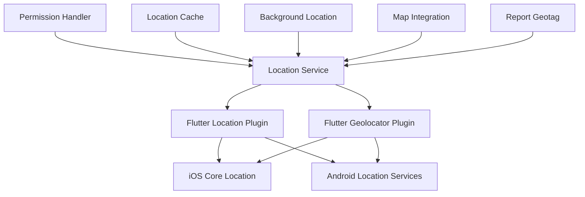

# Location Services

## 🗺️ Location Architecture Overview

The Mosquito Alert app heavily relies on accurate location data for geotagging reports and providing location-based features. The location system uses multiple providers and implements intelligent caching and permission management.

## 🏗️ Location Service Stack

### Location Provider Hierarchy



### Core Location Service

```dart
class LocationService {
  static LocationService? _instance;
  static LocationService get instance => _instance ??= LocationService._internal();
  LocationService._internal();
  
  Position? _lastKnownPosition;
  StreamSubscription<Position>? _positionSubscription;
  bool _isLocationEnabled = false;
  bool _hasPermission = false;
  
  // Location settings
  static const LocationSettings _locationSettings = LocationSettings(
    accuracy: LocationAccuracy.high,
    distanceFilter: 10, // Update every 10 meters
    timeLimit: Duration(seconds: 30),
  );
  
  // Getters
  Position? get lastKnownPosition => _lastKnownPosition;
  bool get isLocationEnabled => _isLocationEnabled;
  bool get hasPermission => _hasPermission;
  
  Future<void> initialize() async {
    await _checkLocationService();
    await _checkPermissions();
    await _loadCachedLocation();
  }
  
  Future<void> _checkLocationService() async {
    try {
      _isLocationEnabled = await Geolocator.isLocationServiceEnabled();
      
      if (!_isLocationEnabled) {
        print('Location services are disabled');
      }
    } catch (e) {
      print('Failed to check location service: $e');
      _isLocationEnabled = false;
    }
  }
  
  Future<void> _checkPermissions() async {
    try {
      LocationPermission permission = await Geolocator.checkPermission();
      
      if (permission == LocationPermission.denied) {
        permission = await Geolocator.requestPermission();
      }
      
      _hasPermission = permission == LocationPermission.whileInUse ||
                      permission == LocationPermission.always;
      
      if (!_hasPermission) {
        print('Location permission denied');
      }
    } catch (e) {
      print('Permission check failed: $e');
      _hasPermission = false;
    }
  }
  
  Future<Position?> getCurrentPosition({
    bool forceRefresh = false,
    Duration? timeout,
  }) async {
    if (!_isLocationEnabled || !_hasPermission) {
      await initialize();
      if (!_isLocationEnabled || !_hasPermission) {
        throw LocationException('Location not available');
      }
    }
    
    // Return cached position if recent and not forcing refresh
    if (!forceRefresh && _lastKnownPosition != null) {
      final age = DateTime.now().difference(_lastKnownPosition!.timestamp);
      if (age.inMinutes < 5) {
        return _lastKnownPosition;
      }
    }
    
    try {
      final position = await Geolocator.getCurrentPosition(
        locationSettings: _locationSettings.copyWith(
          timeLimit: timeout,
        ),
      );
      
      _lastKnownPosition = position;
      await _cacheLocation(position);
      
      return position;
    } on LocationServiceDisabledException {
      throw LocationException('Location services are disabled');
    } on PermissionDeniedException {
      throw LocationException('Location permission denied');
    } on TimeoutException {
      throw LocationException('Location request timed out');
    } catch (e) {
      throw LocationException('Failed to get location: $e');
    }
  }
  
  Stream<Position> getPositionStream() {
    if (!_isLocationEnabled || !_hasPermission) {
      throw LocationException('Location not available');
    }
    
    return Geolocator.getPositionStream(
      locationSettings: _locationSettings,
    );
  }
  
  Future<void> startLocationUpdates() async {
    if (_positionSubscription != null) {
      return; // Already listening
    }
    
    try {
      _positionSubscription = getPositionStream().listen(
        (position) {
          _lastKnownPosition = position;
          _cacheLocation(position);
          _notifyLocationUpdate(position);
        },
        onError: (error) {
          print('Location stream error: $error');
        },
      );
    } catch (e) {
      print('Failed to start location updates: $e');
    }
  }
  
  void stopLocationUpdates() {
    _positionSubscription?.cancel();
    _positionSubscription = null;
  }
  
  Future<String?> getAddressFromCoordinates({
    required double latitude,
    required double longitude,
  }) async {
    try {
      final placemarks = await placemarkFromCoordinates(latitude, longitude);
      
      if (placemarks.isNotEmpty) {
        final placemark = placemarks.first;
        return _formatAddress(placemark);
      }
      
      return null;
    } catch (e) {
      print('Address lookup failed: $e');
      return null;
    }
  }
  
  String _formatAddress(Placemark placemark) {
    final components = <String>[];
    
    if (placemark.street?.isNotEmpty == true) {
      components.add(placemark.street!);
    }
    
    if (placemark.locality?.isNotEmpty == true) {
      components.add(placemark.locality!);
    }
    
    if (placemark.administrativeArea?.isNotEmpty == true) {
      components.add(placemark.administrativeArea!);
    }
    
    if (placemark.country?.isNotEmpty == true) {
      components.add(placemark.country!);
    }
    
    return components.join(', ');
  }
  
  Future<void> _cacheLocation(Position position) async {
    try {
      final prefs = await SharedPreferences.getInstance();
      await prefs.setString('cached_location', jsonEncode({
        'latitude': position.latitude,
        'longitude': position.longitude,
        'accuracy': position.accuracy,
        'timestamp': position.timestamp.toIso8601String(),
      }));
    } catch (e) {
      print('Failed to cache location: $e');
    }
  }
  
  Future<void> _loadCachedLocation() async {
    try {
      final prefs = await SharedPreferences.getInstance();
      final cachedData = prefs.getString('cached_location');
      
      if (cachedData != null) {
        final data = jsonDecode(cachedData);
        _lastKnownPosition = Position(
          latitude: data['latitude'],
          longitude: data['longitude'],
          timestamp: DateTime.parse(data['timestamp']),
          accuracy: data['accuracy'],
          altitude: 0.0,
          altitudeAccuracy: 0.0,
          heading: 0.0,
          headingAccuracy: 0.0,
          speed: 0.0,
          speedAccuracy: 0.0,
        );
      }
    } catch (e) {
      print('Failed to load cached location: $e');
    }
  }
  
  void _notifyLocationUpdate(Position position) {
    // Notify other services about location updates
    EventBus.instance.fire(LocationUpdateEvent(position));
  }
  
  Future<double> calculateDistance({
    required double lat1,
    required double lon1,
    required double lat2,
    required double lon2,
  }) async {
    return Geolocator.distanceBetween(lat1, lon1, lat2, lon2);
  }
  
  void dispose() {
    stopLocationUpdates();
  }
}
```

## 📍 Location Provider Integration

### Provider for State Management

```dart
class LocationProvider with ChangeNotifier {
  Position? _currentPosition;
  String? _currentAddress;
  bool _isLoading = false;
  String? _error;
  
  // Location tracking state
  bool _isTrackingLocation = false;
  StreamSubscription<Position>? _locationSubscription;
  
  // Getters
  Position? get currentPosition => _currentPosition;
  String? get currentAddress => _currentAddress;
  bool get isLoading => _isLoading;
  String? get error => _error;
  bool get isTrackingLocation => _isTrackingLocation;
  bool get hasLocation => _currentPosition != null;
  
  LatLng? get currentLatLng {
    if (_currentPosition == null) return null;
    return LatLng(_currentPosition!.latitude, _currentPosition!.longitude);
  }
  
  Future<void> initialize() async {
    await LocationService.instance.initialize();
    await getCurrentLocation();
  }
  
  Future<void> getCurrentLocation({bool showLoading = true}) async {
    if (showLoading) {
      _setLoading(true);
    }
    
    _clearError();
    
    try {
      final position = await LocationService.instance.getCurrentPosition();
      
      if (position != null) {
        _currentPosition = position;
        await _updateAddress();
      }
    } catch (e) {
      _error = e.toString();
      print('Get current location failed: $e');
    } finally {
      if (showLoading) {
        _setLoading(false);
      }
    }
  }
  
  Future<void> refreshLocation() async {
    try {
      final position = await LocationService.instance.getCurrentPosition(
        forceRefresh: true,
        timeout: Duration(seconds: 15),
      );
      
      if (position != null) {
        _currentPosition = position;
        await _updateAddress();
        notifyListeners();
      }
    } catch (e) {
      print('Location refresh failed: $e');
    }
  }
  
  void startLocationTracking() {
    if (_isTrackingLocation) return;
    
    try {
      _locationSubscription = LocationService.instance
          .getPositionStream()
          .listen(
        (position) {
          _currentPosition = position;
          _updateAddress();
          notifyListeners();
        },
        onError: (error) {
          _error = error.toString();
          notifyListeners();
        },
      );
      
      _isTrackingLocation = true;
      notifyListeners();
    } catch (e) {
      _error = 'Failed to start location tracking: $e';
      notifyListeners();
    }
  }
  
  void stopLocationTracking() {
    _locationSubscription?.cancel();
    _locationSubscription = null;
    _isTrackingLocation = false;
    notifyListeners();
  }
  
  Future<void> _updateAddress() async {
    if (_currentPosition == null) return;
    
    try {
      final address = await LocationService.instance.getAddressFromCoordinates(
        latitude: _currentPosition!.latitude,
        longitude: _currentPosition!.longitude,
      );
      
      _currentAddress = address;
    } catch (e) {
      print('Address lookup failed: $e');
      _currentAddress = null;
    }
  }
  
  Future<void> setManualLocation(double latitude, double longitude) async {
    _currentPosition = Position(
      latitude: latitude,
      longitude: longitude,
      timestamp: DateTime.now(),
      accuracy: 0.0,
      altitude: 0.0,
      altitudeAccuracy: 0.0,
      heading: 0.0,
      headingAccuracy: 0.0,
      speed: 0.0,
      speedAccuracy: 0.0,
    );
    
    await _updateAddress();
    notifyListeners();
  }
  
  String getLocationAccuracyDescription() {
    if (_currentPosition == null) return 'Unknown';
    
    final accuracy = _currentPosition!.accuracy;
    
    if (accuracy <= 5) return 'Excellent';
    if (accuracy <= 10) return 'Good';
    if (accuracy <= 20) return 'Fair';
    if (accuracy <= 50) return 'Poor';
    return 'Very Poor';
  }
  
  Color getLocationAccuracyColor() {
    if (_currentPosition == null) return Colors.grey;
    
    final accuracy = _currentPosition!.accuracy;
    
    if (accuracy <= 5) return Colors.green;
    if (accuracy <= 10) return Colors.lightGreen;
    if (accuracy <= 20) return Colors.orange;
    if (accuracy <= 50) return Colors.deepOrange;
    return Colors.red;
  }
  
  void _setLoading(bool loading) {
    _isLoading = loading;
    notifyListeners();
  }
  
  void _clearError() {
    _error = null;
    notifyListeners();
  }
  
  @override
  void dispose() {
    stopLocationTracking();
    super.dispose();
  }
}
```

## 🎯 Location Accuracy Management

### Accuracy Assessment & User Feedback

```dart
class LocationAccuracyManager {
  static const double EXCELLENT_ACCURACY = 5.0;  // meters
  static const double GOOD_ACCURACY = 10.0;
  static const double FAIR_ACCURACY = 20.0;
  static const double POOR_ACCURACY = 50.0;
  
  static LocationAccuracy assessAccuracy(double accuracyMeters) {
    if (accuracyMeters <= EXCELLENT_ACCURACY) {
      return LocationAccuracy.excellent;
    } else if (accuracyMeters <= GOOD_ACCURACY) {
      return LocationAccuracy.good;
    } else if (accuracyMeters <= FAIR_ACCURACY) {
      return LocationAccuracy.fair;
    } else if (accuracyMeters <= POOR_ACCURACY) {
      return LocationAccuracy.poor;
    } else {
      return LocationAccuracy.veryPoor;
    }
  }
  
  static String getAccuracyMessage(LocationAccuracy accuracy) {
    switch (accuracy) {
      case LocationAccuracy.excellent:
        return 'Excellent location accuracy (±5m)';
      case LocationAccuracy.good:
        return 'Good location accuracy (±10m)';
      case LocationAccuracy.fair:
        return 'Fair location accuracy (±20m)';
      case LocationAccuracy.poor:
        return 'Poor location accuracy (±50m)';
      case LocationAccuracy.veryPoor:
        return 'Very poor location accuracy (>50m)';
    }
  }
  
  static IconData getAccuracyIcon(LocationAccuracy accuracy) {
    switch (accuracy) {
      case LocationAccuracy.excellent:
        return Icons.gps_fixed;
      case LocationAccuracy.good:
        return Icons.gps_fixed;
      case LocationAccuracy.fair:
        return Icons.gps_not_fixed;
      case LocationAccuracy.poor:
        return Icons.gps_not_fixed;
      case LocationAccuracy.veryPoor:
        return Icons.gps_off;
    }
  }
  
  static Color getAccuracyColor(LocationAccuracy accuracy) {
    switch (accuracy) {
      case LocationAccuracy.excellent:
        return Colors.green;
      case LocationAccuracy.good:
        return Colors.lightGreen;
      case LocationAccuracy.fair:
        return Colors.orange;
      case LocationAccuracy.poor:
        return Colors.deepOrange;
      case LocationAccuracy.veryPoor:
        return Colors.red;
    }
  }
  
  static bool isAcceptableForReporting(LocationAccuracy accuracy) {
    return accuracy.index <= LocationAccuracy.fair.index;
  }
  
  static String getImprovementSuggestion(LocationAccuracy accuracy) {
    switch (accuracy) {
      case LocationAccuracy.excellent:
      case LocationAccuracy.good:
        return 'Location accuracy is good for reporting.';
      case LocationAccuracy.fair:
        return 'Consider moving to an open area for better accuracy.';
      case LocationAccuracy.poor:
        return 'Move to an open area away from buildings and trees.';
      case LocationAccuracy.veryPoor:
        return 'Go outside or near a window for better GPS signal.';
    }
  }
}

enum LocationAccuracy {
  excellent,
  good,
  fair,
  poor,
  veryPoor,
}
```

## 🗺️ Map Integration

### Location Display on Maps

```dart
class LocationMapWidget extends StatefulWidget {
  final Position? initialPosition;
  final bool showUserLocation;
  final bool allowManualSelection;
  final Function(LatLng)? onLocationSelected;
  
  const LocationMapWidget({
    Key? key,
    this.initialPosition,
    this.showUserLocation = true,
    this.allowManualSelection = false,
    this.onLocationSelected,
  }) : super(key: key);
  
  @override
  _LocationMapWidgetState createState() => _LocationMapWidgetState();
}

class _LocationMapWidgetState extends State<LocationMapWidget> {
  GoogleMapController? _mapController;
  LatLng? _selectedLocation;
  Marker? _selectedLocationMarker;
  
  @override
  Widget build(BuildContext context) {
    return Consumer<LocationProvider>(
      builder: (context, locationProvider, child) {
        final initialPosition = widget.initialPosition ??
            locationProvider.currentPosition;
        
        if (initialPosition == null) {
          return Center(
            child: Column(
              mainAxisAlignment: MainAxisAlignment.center,
              children: [
                CircularProgressIndicator(),
                SizedBox(height: 16),
                Text('Getting location...'),
                if (locationProvider.error != null) ...[
                  SizedBox(height: 8),
                  Text(
                    locationProvider.error!,
                    style: TextStyle(color: Colors.red),
                    textAlign: TextAlign.center,
                  ),
                  SizedBox(height: 8),
                  ElevatedButton(
                    onPressed: () => locationProvider.getCurrentLocation(),
                    child: Text('Retry'),
                  ),
                ],
              ],
            ),
          );
        }
        
        return GoogleMap(
          onMapCreated: (controller) => _mapController = controller,
          initialCameraPosition: CameraPosition(
            target: LatLng(initialPosition.latitude, initialPosition.longitude),
            zoom: 16.0,
          ),
          myLocationEnabled: widget.showUserLocation,
          myLocationButtonEnabled: true,
          onTap: widget.allowManualSelection ? _onMapTap : null,
          markers: _buildMarkers(locationProvider),
          circles: _buildAccuracyCircle(initialPosition),
        );
      },
    );
  }
  
  void _onMapTap(LatLng location) {
    if (!widget.allowManualSelection) return;
    
    setState(() {
      _selectedLocation = location;
      _selectedLocationMarker = Marker(
        markerId: MarkerId('selected_location'),
        position: location,
        icon: BitmapDescriptor.defaultMarkerWithHue(BitmapDescriptor.hueRed),
        infoWindow: InfoWindow(
          title: 'Selected Location',
          snippet: '${location.latitude.toStringAsFixed(6)}, '
                  '${location.longitude.toStringAsFixed(6)}',
        ),
      );
    });
    
    widget.onLocationSelected?.call(location);
  }
  
  Set<Marker> _buildMarkers(LocationProvider locationProvider) {
    final markers = <Marker>{};
    
    // Add selected location marker
    if (_selectedLocationMarker != null) {
      markers.add(_selectedLocationMarker!);
    }
    
    return markers;
  }
  
  Set<Circle> _buildAccuracyCircle(Position position) {
    final accuracy = LocationAccuracyManager.assessAccuracy(position.accuracy);
    
    return {
      Circle(
        circleId: CircleId('accuracy_circle'),
        center: LatLng(position.latitude, position.longitude),
        radius: position.accuracy,
        fillColor: LocationAccuracyManager.getAccuracyColor(accuracy)
            .withOpacity(0.2),
        strokeColor: LocationAccuracyManager.getAccuracyColor(accuracy),
        strokeWidth: 1,
      ),
    };
  }
}
```

## 🎯 Location Selection UI

### Interactive Location Picker

```dart
class LocationPickerScreen extends StatefulWidget {
  final Position? initialPosition;
  
  const LocationPickerScreen({Key? key, this.initialPosition}) : super(key: key);
  
  @override
  _LocationPickerScreenState createState() => _LocationPickerScreenState();
}

class _LocationPickerScreenState extends State<LocationPickerScreen> {
  LatLng? _selectedLocation;
  String? _selectedAddress;
  bool _isLoadingAddress = false;
  
  @override
  Widget build(BuildContext context) {
    return Scaffold(
      appBar: AppBar(
        title: Text('Select Location'),
        actions: [
          if (_selectedLocation != null)
            TextButton(
              onPressed: _confirmLocation,
              child: Text('CONFIRM', style: TextStyle(color: Colors.white)),
            ),
        ],
      ),
      body: Column(
        children: [
          // Location info card
          Container(
            padding: EdgeInsets.all(16),
            margin: EdgeInsets.all(16),
            decoration: BoxDecoration(
              color: Colors.white,
              borderRadius: BorderRadius.circular(12),
              boxShadow: [
                BoxShadow(
                  color: Colors.black.withOpacity(0.1),
                  blurRadius: 4,
                  offset: Offset(0, 2),
                ),
              ],
            ),
            child: Column(
              crossAxisAlignment: CrossAxisAlignment.start,
              children: [
                Row(
                  children: [
                    Icon(Icons.location_on, color: Colors.red),
                    SizedBox(width: 8),
                    Text(
                      'Selected Location',
                      style: Theme.of(context).textTheme.titleMedium,
                    ),
                  ],
                ),
                SizedBox(height: 8),
                if (_selectedLocation != null) ...[
                  Text(
                    'Coordinates: ${_selectedLocation!.latitude.toStringAsFixed(6)}, '
                    '${_selectedLocation!.longitude.toStringAsFixed(6)}',
                    style: Theme.of(context).textTheme.bodySmall,
                  ),
                  if (_isLoadingAddress) ...[
                    SizedBox(height: 4),
                    Row(
                      children: [
                        SizedBox(
                          width: 12,
                          height: 12,
                          child: CircularProgressIndicator(strokeWidth: 2),
                        ),
                        SizedBox(width: 8),
                        Text('Looking up address...'),
                      ],
                    ),
                  ] else if (_selectedAddress != null) ...[
                    SizedBox(height: 4),
                    Text(
                      _selectedAddress!,
                      style: Theme.of(context).textTheme.bodyMedium,
                    ),
                  ],
                ] else ...[
                  Text(
                    'Tap on the map to select a location',
                    style: Theme.of(context).textTheme.bodyMedium,
                  ),
                ],
              ],
            ),
          ),
          
          // Map
          Expanded(
            child: LocationMapWidget(
              initialPosition: widget.initialPosition,
              allowManualSelection: true,
              onLocationSelected: _onLocationSelected,
            ),
          ),
        ],
      ),
      floatingActionButton: FloatingActionButton(
        onPressed: _useCurrentLocation,
        child: Icon(Icons.my_location),
        tooltip: 'Use Current Location',
      ),
    );
  }
  
  void _onLocationSelected(LatLng location) {
    setState(() {
      _selectedLocation = location;
      _selectedAddress = null;
      _isLoadingAddress = true;
    });
    
    _lookupAddress(location);
  }
  
  Future<void> _lookupAddress(LatLng location) async {
    try {
      final address = await LocationService.instance.getAddressFromCoordinates(
        latitude: location.latitude,
        longitude: location.longitude,
      );
      
      if (mounted) {
        setState(() {
          _selectedAddress = address;
          _isLoadingAddress = false;
        });
      }
    } catch (e) {
      if (mounted) {
        setState(() {
          _isLoadingAddress = false;
        });
      }
    }
  }
  
  Future<void> _useCurrentLocation() async {
    try {
      final position = await LocationService.instance.getCurrentPosition(
        forceRefresh: true,
      );
      
      if (position != null) {
        final location = LatLng(position.latitude, position.longitude);
        _onLocationSelected(location);
      }
    } catch (e) {
      ScaffoldMessenger.of(context).showSnackBar(
        SnackBar(
          content: Text('Failed to get current location: $e'),
          backgroundColor: Colors.red,
        ),
      );
    }
  }
  
  void _confirmLocation() {
    if (_selectedLocation != null) {
      Navigator.of(context).pop({
        'location': _selectedLocation,
        'address': _selectedAddress,
      });
    }
  }
}
```

## 🚨 Location Error Handling

### Comprehensive Error Management

```dart
class LocationErrorHandler {
  static void handleLocationError(
    BuildContext context,
    String error, {
    VoidCallback? onRetry,
    VoidCallback? onSettings,
  }) {
    late String title;
    late String message;
    late List<Widget> actions;
    
    if (error.contains('permission')) {
      title = 'Location Permission Required';
      message = 'This app needs location permission to tag your reports with location data.';
      actions = [
        TextButton(
          onPressed: () => Navigator.of(context).pop(),
          child: Text('Cancel'),
        ),
        ElevatedButton(
          onPressed: () {
            Navigator.of(context).pop();
            onSettings?.call();
            _openAppSettings();
          },
          child: Text('Open Settings'),
        ),
      ];
    } else if (error.contains('disabled')) {
      title = 'Location Services Disabled';
      message = 'Please enable location services in your device settings.';
      actions = [
        TextButton(
          onPressed: () => Navigator.of(context).pop(),
          child: Text('Cancel'),
        ),
        ElevatedButton(
          onPressed: () {
            Navigator.of(context).pop();
            _openLocationSettings();
          },
          child: Text('Open Settings'),
        ),
      ];
    } else if (error.contains('timeout')) {
      title = 'Location Timeout';
      message = 'Could not get your location. This might be due to poor GPS signal.';
      actions = [
        TextButton(
          onPressed: () => Navigator.of(context).pop(),
          child: Text('Cancel'),
        ),
        if (onRetry != null)
          ElevatedButton(
            onPressed: () {
              Navigator.of(context).pop();
              onRetry();
            },
            child: Text('Try Again'),
          ),
      ];
    } else {
      title = 'Location Error';
      message = 'An error occurred while getting your location: $error';
      actions = [
        TextButton(
          onPressed: () => Navigator.of(context).pop(),
          child: Text('OK'),
        ),
        if (onRetry != null)
          ElevatedButton(
            onPressed: () {
              Navigator.of(context).pop();
              onRetry();
            },
            child: Text('Try Again'),
          ),
      ];
    }
    
    showDialog(
      context: context,
      builder: (context) => AlertDialog(
        title: Text(title),
        content: Text(message),
        actions: actions,
      ),
    );
  }
  
  static Future<void> _openAppSettings() async {
    await openAppSettings();
  }
  
  static Future<void> _openLocationSettings() async {
    await Geolocator.openLocationSettings();
  }
}

class LocationException implements Exception {
  final String message;
  
  LocationException(this.message);
  
  @override
  String toString() => message;
}
```

## 🔋 Battery Optimization

### Efficient Location Usage

```dart
class LocationBatteryOptimizer {
  static const Duration STANDARD_UPDATE_INTERVAL = Duration(minutes: 1);
  static const Duration BACKGROUND_UPDATE_INTERVAL = Duration(minutes: 5);
  static const double MINIMUM_DISTANCE_FILTER = 10.0; // meters
  
  static LocationSettings getOptimizedSettings({
    bool isInBackground = false,
    bool highAccuracyRequired = false,
  }) {
    if (isInBackground) {
      return LocationSettings(
        accuracy: LocationAccuracy.low,
        distanceFilter: MINIMUM_DISTANCE_FILTER * 2,
        timeLimit: Duration(seconds: 15),
      );
    }
    
    if (highAccuracyRequired) {
      return LocationSettings(
        accuracy: LocationAccuracy.best,
        distanceFilter: MINIMUM_DISTANCE_FILTER / 2,
        timeLimit: Duration(seconds: 30),
      );
    }
    
    return LocationSettings(
      accuracy: LocationAccuracy.high,
      distanceFilter: MINIMUM_DISTANCE_FILTER,
      timeLimit: Duration(seconds: 20),
    );
  }
  
  static bool shouldRequestLocationUpdate(Position? lastPosition) {
    if (lastPosition == null) return true;
    
    final timeSinceLastUpdate = DateTime.now().difference(lastPosition.timestamp);
    return timeSinceLastUpdate > STANDARD_UPDATE_INTERVAL;
  }
  
  static LocationAccuracy getRecommendedAccuracy({
    required bool isOnBattery,
    required int batteryLevel,
  }) {
    if (!isOnBattery || batteryLevel > 50) {
      return LocationAccuracy.high;
    } else if (batteryLevel > 20) {
      return LocationAccuracy.medium;
    } else {
      return LocationAccuracy.low;
    }
  }
}
```

This location services implementation provides comprehensive location functionality while being mindful of battery usage, user privacy, and providing a good user experience with proper error handling and feedback.
