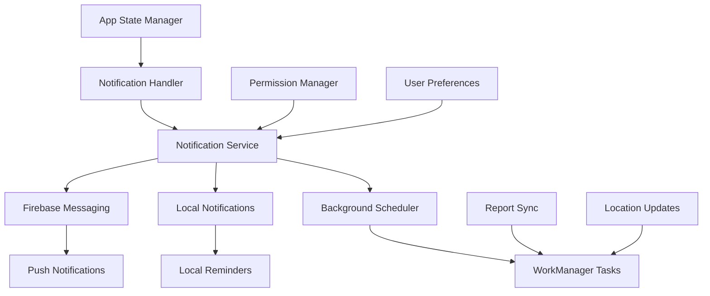

# Notifications & Background Tasks

## 🔔 Notification System Overview

The Mosquito Alert app uses a comprehensive notification system that combines Firebase Cloud Messaging (FCM) for push notifications, local notifications for user engagement, and background task management for data synchronization.

## 🏗️ Notification Architecture

### Notification Stack



### Core Notification Service

```dart
class NotificationService {
  static NotificationService? _instance;
  static NotificationService get instance => _instance ??= NotificationService._internal();
  NotificationService._internal();
  
  FlutterLocalNotificationsPlugin? _localNotifications;
  FirebaseMessaging? _firebaseMessaging;
  
  bool _isInitialized = false;
  String? _fcmToken;
  
  // Notification channels
  static const String CHANNEL_REPORTS = 'reports';
  static const String CHANNEL_REMINDERS = 'reminders';
  static const String CHANNEL_ALERTS = 'alerts';
  static const String CHANNEL_SYSTEM = 'system';
  
  bool get isInitialized => _isInitialized;
  String? get fcmToken => _fcmToken;
  
  Future<void> initialize() async {
    if (_isInitialized) return;
    
    try {
      await _initializeLocalNotifications();
      await _initializeFirebaseMessaging();
      await _setupNotificationChannels();
      await _requestPermissions();
      
      _isInitialized = true;
    } catch (e) {
      print('Notification service initialization failed: $e');
    }
  }
  
  Future<void> _initializeLocalNotifications() async {
    _localNotifications = FlutterLocalNotificationsPlugin();
    
    const androidSettings = AndroidInitializationSettings('@mipmap/ic_launcher');
    const iosSettings = DarwinInitializationSettings(
      requestAlertPermission: false,
      requestBadgePermission: false,
      requestSoundPermission: false,
    );
    
    const initSettings = InitializationSettings(
      android: androidSettings,
      iOS: iosSettings,
    );
    
    await _localNotifications!.initialize(
      initSettings,
      onDidReceiveNotificationResponse: _onNotificationTapped,
    );
  }
  
  Future<void> _initializeFirebaseMessaging() async {
    _firebaseMessaging = FirebaseMessaging.instance;
    
    // Get FCM token
    _fcmToken = await _firebaseMessaging!.getToken();
    print('FCM Token: $_fcmToken');
    
    // Listen for token refresh
    _firebaseMessaging!.onTokenRefresh.listen((token) {
      _fcmToken = token;
      _sendTokenToServer(token);
    });
    
    // Handle foreground messages
    FirebaseMessaging.onMessage.listen(_handleForegroundMessage);
    
    // Handle background messages
    FirebaseMessaging.onBackgroundMessage(_handleBackgroundMessage);
    
    // Handle notification taps
    FirebaseMessaging.onMessageOpenedApp.listen(_handleNotificationTap);
    
    // Check for notification that opened the app
    final initialMessage = await _firebaseMessaging!.getInitialMessage();
    if (initialMessage != null) {
      _handleNotificationTap(initialMessage);
    }
  }
  
  Future<void> _setupNotificationChannels() async {
    if (Platform.isAndroid) {
      await _localNotifications!
          .resolvePlatformSpecificImplementation<
              AndroidFlutterLocalNotificationsPlugin>()
          ?.createNotificationChannels([
        const AndroidNotificationChannel(
          CHANNEL_REPORTS,
          'Report Updates',
          description: 'Notifications about your mosquito reports',
          importance: Importance.high,
        ),
        const AndroidNotificationChannel(
          CHANNEL_REMINDERS,
          'Reminders',
          description: 'Reminders to submit reports',
          importance: Importance.defaultImportance,
        ),
        const AndroidNotificationChannel(
          CHANNEL_ALERTS,
          'Mosquito Alerts',
          description: 'Alerts about mosquito activity in your area',
          importance: Importance.high,
        ),
        const AndroidNotificationChannel(
          CHANNEL_SYSTEM,
          'System',
          description: 'System notifications and updates',
          importance: Importance.low,
        ),
      ]);
    }
  }
  
  Future<void> _requestPermissions() async {
    if (Platform.isIOS) {
      await _firebaseMessaging!.requestPermission(
        alert: true,
        badge: true,
        sound: true,
        provisional: false,
      );
    }
    
    if (Platform.isAndroid) {
      await _localNotifications!
          .resolvePlatformSpecificImplementation<
              AndroidFlutterLocalNotificationsPlugin>()
          ?.requestPermission();
    }
  }
  
  // Local notification methods
  Future<void> showLocalNotification({
    required int id,
    required String title,
    required String body,
    String? payload,
    String channelId = CHANNEL_SYSTEM,
    NotificationPriority priority = NotificationPriority.defaultPriority,
  }) async {
    if (!_isInitialized) await initialize();
    
    const androidDetails = AndroidNotificationDetails(
      'default_channel',
      'Default',
      importance: Importance.defaultImportance,
      priority: Priority.defaultPriority,
    );
    
    const iosDetails = DarwinNotificationDetails();
    
    const details = NotificationDetails(
      android: androidDetails,
      iOS: iosDetails,
    );
    
    await _localNotifications!.show(
      id,
      title,
      body,
      details,
      payload: payload,
    );
  }
  
  Future<void> scheduleNotification({
    required int id,
    required String title,
    required String body,
    required DateTime scheduledTime,
    String? payload,
    String channelId = CHANNEL_REMINDERS,
  }) async {
    if (!_isInitialized) await initialize();
    
    await _localNotifications!.zonedSchedule(
      id,
      title,
      body,
      tz.TZDateTime.from(scheduledTime, tz.local),
      const NotificationDetails(
        android: AndroidNotificationDetails(
          'scheduled_channel',
          'Scheduled Notifications',
          importance: Importance.defaultImportance,
        ),
        iOS: DarwinNotificationDetails(),
      ),
      payload: payload,
      uiLocalNotificationDateInterpretation:
          UILocalNotificationDateInterpretation.absoluteTime,
    );
  }
  
  Future<void> showReportStatusNotification({
    required String reportId,
    required String status,
    String? message,
  }) async {
    final title = _getReportStatusTitle(status);
    final body = message ?? _getReportStatusMessage(status);
    
    await showLocalNotification(
      id: reportId.hashCode,
      title: title,
      body: body,
      payload: jsonEncode({
        'type': 'report_status',
        'report_id': reportId,
        'status': status,
      }),
      channelId: CHANNEL_REPORTS,
    );
  }
  
  Future<void> scheduleReportReminder({
    required DateTime reminderTime,
    String? customMessage,
  }) async {
    final title = 'Mosquito Report Reminder';
    final body = customMessage ?? 
        'Have you seen any mosquitoes today? Help scientists by reporting your observations!';
    
    await scheduleNotification(
      id: 'reminder_${reminderTime.millisecondsSinceEpoch}'.hashCode,
      title: title,
      body: body,
      scheduledTime: reminderTime,
      payload: jsonEncode({
        'type': 'reminder',
        'action': 'create_report',
      }),
    );
  }
  
  Future<void> showMosquitoAlert({
    required String location,
    required int reportCount,
    String? species,
  }) async {
    final title = 'Mosquito Activity Alert';
    final body = species != null
        ? '$reportCount $species reports near $location'
        : '$reportCount mosquito reports near $location';
    
    await showLocalNotification(
      id: 'alert_${location.hashCode}'.hashCode,
      title: title,
      body: body,
      payload: jsonEncode({
        'type': 'mosquito_alert',
        'location': location,
        'count': reportCount,
        'species': species,
      }),
      channelId: CHANNEL_ALERTS,
      priority: NotificationPriority.high,
    );
  }
  
  // Firebase messaging handlers
  Future<void> _handleForegroundMessage(RemoteMessage message) async {
    print('Received foreground message: ${message.messageId}');
    
    // Show local notification for foreground messages
    final notification = message.notification;
    if (notification != null) {
      await showLocalNotification(
        id: message.hashCode,
        title: notification.title ?? 'Mosquito Alert',
        body: notification.body ?? '',
        payload: jsonEncode(message.data),
      );
    }
    
    // Handle data-only messages
    if (message.data.isNotEmpty) {
      _processNotificationData(message.data);
    }
  }
  
  static Future<void> _handleBackgroundMessage(RemoteMessage message) async {
    print('Received background message: ${message.messageId}');
    
    // Process background message
    if (message.data.isNotEmpty) {
      await _processBackgroundData(message.data);
    }
  }
  
  void _handleNotificationTap(RemoteMessage message) {
    print('Notification tapped: ${message.messageId}');
    
    // Navigate based on notification data
    final data = message.data;
    if (data.isNotEmpty) {
      NavigationService.handleNotificationNavigation(data);
    }
  }
  
  void _onNotificationTapped(NotificationResponse response) {
    print('Local notification tapped: ${response.payload}');
    
    if (response.payload != null) {
      try {
        final data = jsonDecode(response.payload!);
        NavigationService.handleNotificationNavigation(data);
      } catch (e) {
        print('Failed to parse notification payload: $e');
      }
    }
  }
  
  void _processNotificationData(Map<String, dynamic> data) {
    final type = data['type'];
    
    switch (type) {
      case 'report_update':
        _handleReportUpdate(data);
        break;
      case 'mosquito_alert':
        _handleMosquitoAlert(data);
        break;
      case 'sync_request':
        _handleSyncRequest(data);
        break;
      default:
        print('Unknown notification type: $type');
    }
  }
  
  static Future<void> _processBackgroundData(Map<String, dynamic> data) async {
    // Handle background data processing
    final type = data['type'];
    
    switch (type) {
      case 'sync_request':
        await SyncService.performSync();
        break;
      case 'data_update':
        // Trigger data refresh
        break;
    }
  }
  
  void _handleReportUpdate(Map<String, dynamic> data) {
    final reportId = data['report_id'];
    final status = data['status'];
    
    // Update report status in local storage
    // Notify UI about the update
    EventBus.instance.fire(ReportStatusUpdateEvent(reportId, status));
  }
  
  void _handleMosquitoAlert(Map<String, dynamic> data) {
    // Process mosquito alert data
    final location = data['location'];
    final count = data['count'];
    
    // Store alert for later display
    AlertStorageService.storeAlert(data);
  }
  
  void _handleSyncRequest(Map<String, dynamic> data) {
    // Trigger immediate sync
    SyncService.scheduleImmediateSync();
  }
  
  Future<void> _sendTokenToServer(String token) async {
    try {
      await ApiClient.instance.dio.post('/user/fcm-token', data: {
        'token': token,
        'platform': Platform.isIOS ? 'ios' : 'android',
      });
    } catch (e) {
      print('Failed to send FCM token to server: $e');
    }
  }
  
  String _getReportStatusTitle(String status) {
    switch (status) {
      case 'received':
        return 'Report Received';
      case 'processing':
        return 'Report Being Processed';
      case 'verified':
        return 'Report Verified';
      case 'rejected':
        return 'Report Needs Review';
      default:
        return 'Report Update';
    }
  }
  
  String _getReportStatusMessage(String status) {
    switch (status) {
      case 'received':
        return 'Thank you! Your mosquito report has been received.';
      case 'processing':
        return 'Experts are reviewing your mosquito report.';
      case 'verified':
        return 'Great! Your report has been verified by our experts.';
      case 'rejected':
        return 'Your report needs additional information.';
      default:
        return 'Your report status has been updated.';
    }
  }
  
  // Utility methods
  Future<void> cancelNotification(int id) async {
    await _localNotifications?.cancel(id);
  }
  
  Future<void> cancelAllNotifications() async {
    await _localNotifications?.cancelAll();
  }
  
  Future<List<PendingNotificationRequest>> getPendingNotifications() async {
    return await _localNotifications?.pendingNotificationRequests() ?? [];
  }
}
```

## 🔄 Background Task Management

### WorkManager Integration

```dart
class BackgroundTaskService {
  static const String SYNC_TASK = 'sync_reports';
  static const String CLEANUP_TASK = 'cleanup_data';
  static const String LOCATION_UPDATE_TASK = 'location_update';
  
  static Future<void> initialize() async {
    await Workmanager().initialize(
      callbackDispatcher,
      isInDebugMode: kDebugMode,
    );
    
    await _schedulePeriodicTasks();
  }
  
  static Future<void> _schedulePeriodicTasks() async {
    // Schedule periodic sync
    await Workmanager().registerPeriodicTask(
      SYNC_TASK,
      SYNC_TASK,
      frequency: Duration(hours: 1),
      constraints: Constraints(
        networkType: NetworkType.connected,
        requiresBatteryNotLow: true,
      ),
      backoffPolicy: BackoffPolicy.exponential,
      backoffPolicyDelay: Duration(minutes: 15),
    );
    
    // Schedule daily cleanup
    await Workmanager().registerPeriodicTask(
      CLEANUP_TASK,
      CLEANUP_TASK,
      frequency: Duration(hours: 24),
      constraints: Constraints(
        requiresCharging: false,
        requiresBatteryNotLow: true,
      ),
    );
  }
  
  static Future<void> scheduleOneOffSync() async {
    await Workmanager().registerOneOffTask(
      '${SYNC_TASK}_${DateTime.now().millisecondsSinceEpoch}',
      SYNC_TASK,
      constraints: Constraints(
        networkType: NetworkType.connected,
      ),
      initialDelay: Duration(seconds: 5),
    );
  }
  
  static Future<void> scheduleLocationUpdate() async {
    await Workmanager().registerOneOffTask(
      '${LOCATION_UPDATE_TASK}_${DateTime.now().millisecondsSinceEpoch}',
      LOCATION_UPDATE_TASK,
      constraints: Constraints(
        networkType: NetworkType.not_required,
      ),
      initialDelay: Duration(minutes: 1),
    );
  }
  
  static Future<void> cancelAllTasks() async {
    await Workmanager().cancelAll();
  }
  
  static Future<void> cancelTask(String taskId) async {
    await Workmanager().cancelByUniqueName(taskId);
  }
}

@pragma('vm:entry-point')
void callbackDispatcher() {
  Workmanager().executeTask((task, inputData) async {
    try {
      print('Background task started: $task');
      
      switch (task) {
        case BackgroundTaskService.SYNC_TASK:
          return await _performSyncTask();
          
        case BackgroundTaskService.CLEANUP_TASK:
          return await _performCleanupTask();
          
        case BackgroundTaskService.LOCATION_UPDATE_TASK:
          return await _performLocationUpdateTask();
          
        default:
          print('Unknown background task: $task');
          return false;
      }
    } catch (e) {
      print('Background task failed: $task - $e');
      return false;
    }
  });
}

Future<bool> _performSyncTask() async {
  try {
    // Initialize necessary services
    await Firebase.initializeApp();
    
    // Perform sync
    return await SyncService.performSync();
  } catch (e) {
    print('Sync task failed: $e');
    return false;
  }
}

Future<bool> _performCleanupTask() async {
  try {
    // Clean up old files
    await MediaStorageService.cleanupOldMedia();
    
    // Clean up old cached data
    await CacheManager.cleanupOldData();
    
    // Clean up old notifications
    await NotificationService.instance.cancelAllNotifications();
    
    return true;
  } catch (e) {
    print('Cleanup task failed: $e');
    return false;
  }
}

Future<bool> _performLocationUpdateTask() async {
  try {
    // Update location cache if needed
    final locationService = LocationService.instance;
    await locationService.initialize();
    
    final position = await locationService.getCurrentPosition();
    
    if (position != null) {
      // Cache the new location
      print('Background location updated: ${position.latitude}, ${position.longitude}');
    }
    
    return true;
  } catch (e) {
    print('Location update task failed: $e');
    return false;
  }
}
```

## 📱 Notification Provider

### State Management for Notifications

```dart
class NotificationProvider with ChangeNotifier {
  List<AppNotification> _notifications = [];
  bool _permissionsGranted = false;
  bool _isInitialized = false;
  
  // User preferences
  bool _reportNotificationsEnabled = true;
  bool _reminderNotificationsEnabled = true;
  bool _alertNotificationsEnabled = true;
  
  // Getters
  List<AppNotification> get notifications => List.unmodifiable(_notifications);
  List<AppNotification> get unreadNotifications => 
      _notifications.where((n) => !n.isRead).toList();
  bool get permissionsGranted => _permissionsGranted;
  bool get isInitialized => _isInitialized;
  
  bool get reportNotificationsEnabled => _reportNotificationsEnabled;
  bool get reminderNotificationsEnabled => _reminderNotificationsEnabled;
  bool get alertNotificationsEnabled => _alertNotificationsEnabled;
  
  int get unreadCount => unreadNotifications.length;
  
  Future<void> initialize() async {
    if (_isInitialized) return;
    
    try {
      await NotificationService.instance.initialize();
      await _loadPreferences();
      await _loadStoredNotifications();
      await _checkPermissions();
      
      _isInitialized = true;
      notifyListeners();
    } catch (e) {
      print('Notification provider initialization failed: $e');
    }
  }
  
  Future<void> _loadPreferences() async {
    final prefs = await SharedPreferences.getInstance();
    
    _reportNotificationsEnabled = prefs.getBool('notifications_reports') ?? true;
    _reminderNotificationsEnabled = prefs.getBool('notifications_reminders') ?? true;
    _alertNotificationsEnabled = prefs.getBool('notifications_alerts') ?? true;
  }
  
  Future<void> _loadStoredNotifications() async {
    try {
      final prefs = await SharedPreferences.getInstance();
      final notificationsJson = prefs.getStringList('stored_notifications') ?? [];
      
      _notifications = notificationsJson
          .map((json) => AppNotification.fromJson(jsonDecode(json)))
          .toList();
      
      // Sort by timestamp (newest first)
      _notifications.sort((a, b) => b.timestamp.compareTo(a.timestamp));
    } catch (e) {
      print('Failed to load stored notifications: $e');
    }
  }
  
  Future<void> _saveNotifications() async {
    try {
      final prefs = await SharedPreferences.getInstance();
      final notificationsJson = _notifications
          .map((notification) => jsonEncode(notification.toJson()))
          .toList();
      
      await prefs.setStringList('stored_notifications', notificationsJson);
    } catch (e) {
      print('Failed to save notifications: $e');
    }
  }
  
  Future<void> _checkPermissions() async {
    if (Platform.isAndroid) {
      final androidPlugin = NotificationService.instance._localNotifications!
          .resolvePlatformSpecificImplementation<
              AndroidFlutterLocalNotificationsPlugin>();
      
      _permissionsGranted = await androidPlugin?.areNotificationsEnabled() ?? false;
    } else {
      _permissionsGranted = true; // iOS permissions are handled during initialization
    }
  }
  
  Future<void> addNotification(AppNotification notification) async {
    _notifications.insert(0, notification);
    
    // Limit stored notifications to last 100
    if (_notifications.length > 100) {
      _notifications = _notifications.take(100).toList();
    }
    
    await _saveNotifications();
    notifyListeners();
  }
  
  Future<void> markAsRead(String notificationId) async {
    final index = _notifications.indexWhere((n) => n.id == notificationId);
    if (index >= 0) {
      _notifications[index] = _notifications[index].copyWith(isRead: true);
      await _saveNotifications();
      notifyListeners();
    }
  }
  
  Future<void> markAllAsRead() async {
    for (int i = 0; i < _notifications.length; i++) {
      _notifications[i] = _notifications[i].copyWith(isRead: true);
    }
    
    await _saveNotifications();
    notifyListeners();
  }
  
  Future<void> deleteNotification(String notificationId) async {
    _notifications.removeWhere((n) => n.id == notificationId);
    await _saveNotifications();
    notifyListeners();
  }
  
  Future<void> clearAllNotifications() async {
    _notifications.clear();
    await _saveNotifications();
    notifyListeners();
  }
  
  // Preference setters
  Future<void> setReportNotifications(bool enabled) async {
    _reportNotificationsEnabled = enabled;
    await _savePreference('notifications_reports', enabled);
    notifyListeners();
  }
  
  Future<void> setReminderNotifications(bool enabled) async {
    _reminderNotificationsEnabled = enabled;
    await _savePreference('notifications_reminders', enabled);
    
    if (enabled) {
      await _scheduleReminderNotifications();
    } else {
      await _cancelReminderNotifications();
    }
    
    notifyListeners();
  }
  
  Future<void> setAlertNotifications(bool enabled) async {
    _alertNotificationsEnabled = enabled;
    await _savePreference('notifications_alerts', enabled);
    notifyListeners();
  }
  
  Future<void> _savePreference(String key, bool value) async {
    final prefs = await SharedPreferences.getInstance();
    await prefs.setBool(key, value);
  }
  
  Future<void> _scheduleReminderNotifications() async {
    // Schedule daily reminder at 6 PM
    final now = DateTime.now();
    final reminderTime = DateTime(now.year, now.month, now.day, 18, 0);
    
    if (reminderTime.isBefore(now)) {
      // If 6 PM has passed today, schedule for tomorrow
      reminderTime.add(Duration(days: 1));
    }
    
    await NotificationService.instance.scheduleReportReminder(
      reminderTime: reminderTime,
    );
  }
  
  Future<void> _cancelReminderNotifications() async {
    // Cancel all reminder notifications
    final pendingNotifications = await NotificationService.instance.getPendingNotifications();
    
    for (final notification in pendingNotifications) {
      if (notification.payload?.contains('reminder') == true) {
        await NotificationService.instance.cancelNotification(notification.id);
      }
    }
  }
  
  Future<void> requestPermissions() async {
    if (Platform.isAndroid) {
      final androidPlugin = NotificationService.instance._localNotifications!
          .resolvePlatformSpecificImplementation<
              AndroidFlutterLocalNotificationsPlugin>();
      
      final granted = await androidPlugin?.requestPermission();
      _permissionsGranted = granted ?? false;
    } else if (Platform.isIOS) {
      final settings = await FirebaseMessaging.instance.requestPermission();
      _permissionsGranted = settings.authorizationStatus == AuthorizationStatus.authorized;
    }
    
    notifyListeners();
  }
}

class AppNotification {
  final String id;
  final String title;
  final String body;
  final DateTime timestamp;
  final String type;
  final Map<String, dynamic>? data;
  final bool isRead;
  
  AppNotification({
    required this.id,
    required this.title,
    required this.body,
    required this.timestamp,
    required this.type,
    this.data,
    this.isRead = false,
  });
  
  factory AppNotification.fromJson(Map<String, dynamic> json) {
    return AppNotification(
      id: json['id'],
      title: json['title'],
      body: json['body'],
      timestamp: DateTime.parse(json['timestamp']),
      type: json['type'],
      data: json['data'],
      isRead: json['is_read'] ?? false,
    );
  }
  
  Map<String, dynamic> toJson() {
    return {
      'id': id,
      'title': title,
      'body': body,
      'timestamp': timestamp.toIso8601String(),
      'type': type,
      'data': data,
      'is_read': isRead,
    };
  }
  
  AppNotification copyWith({
    String? id,
    String? title,
    String? body,
    DateTime? timestamp,
    String? type,
    Map<String, dynamic>? data,
    bool? isRead,
  }) {
    return AppNotification(
      id: id ?? this.id,
      title: title ?? this.title,
      body: body ?? this.body,
      timestamp: timestamp ?? this.timestamp,
      type: type ?? this.type,
      data: data ?? this.data,
      isRead: isRead ?? this.isRead,
    );
  }
}
```

## 🔔 Notification UI Components

### Notification List Screen

```dart
class NotificationScreen extends StatelessWidget {
  @override
  Widget build(BuildContext context) {
    return Scaffold(
      appBar: AppBar(
        title: Text('Notifications'),
        actions: [
          Consumer<NotificationProvider>(
            builder: (context, provider, child) {
              if (provider.unreadCount > 0) {
                return TextButton(
                  onPressed: () => provider.markAllAsRead(),
                  child: Text('Mark All Read', style: TextStyle(color: Colors.white)),
                );
              }
              return SizedBox.shrink();
            },
          ),
        ],
      ),
      body: Consumer<NotificationProvider>(
        builder: (context, provider, child) {
          if (!provider.isInitialized) {
            return Center(child: CircularProgressIndicator());
          }
          
          if (provider.notifications.isEmpty) {
            return Center(
              child: Column(
                mainAxisAlignment: MainAxisAlignment.center,
                children: [
                  Icon(Icons.notifications_none, size: 64, color: Colors.grey),
                  SizedBox(height: 16),
                  Text(
                    'No notifications yet',
                    style: Theme.of(context).textTheme.titleLarge,
                  ),
                  SizedBox(height: 8),
                  Text(
                    'You\'ll see updates about your reports here',
                    style: Theme.of(context).textTheme.bodyMedium,
                    textAlign: TextAlign.center,
                  ),
                ],
              ),
            );
          }
          
          return ListView.separated(
            itemCount: provider.notifications.length,
            separatorBuilder: (context, index) => Divider(height: 1),
            itemBuilder: (context, index) {
              final notification = provider.notifications[index];
              return NotificationTile(
                notification: notification,
                onTap: () => _handleNotificationTap(context, notification),
                onDismiss: () => provider.deleteNotification(notification.id),
              );
            },
          );
        },
      ),
    );
  }
  
  void _handleNotificationTap(BuildContext context, AppNotification notification) {
    final provider = Provider.of<NotificationProvider>(context, listen: false);
    
    // Mark as read
    provider.markAsRead(notification.id);
    
    // Navigate based on notification type
    switch (notification.type) {
      case 'report_status':
        final reportId = notification.data?['report_id'];
        if (reportId != null) {
          Navigator.pushNamed(context, '/report-details', arguments: reportId);
        }
        break;
      case 'mosquito_alert':
        Navigator.pushNamed(context, '/map');
        break;
      case 'reminder':
        Navigator.pushNamed(context, '/camera');
        break;
    }
  }
}

class NotificationTile extends StatelessWidget {
  final AppNotification notification;
  final VoidCallback onTap;
  final VoidCallback onDismiss;
  
  const NotificationTile({
    Key? key,
    required this.notification,
    required this.onTap,
    required this.onDismiss,
  }) : super(key: key);
  
  @override
  Widget build(BuildContext context) {
    return Dismissible(
      key: Key(notification.id),
      direction: DismissDirection.endToStart,
      onDismissed: (direction) => onDismiss(),
      background: Container(
        color: Colors.red,
        alignment: Alignment.centerRight,
        padding: EdgeInsets.only(right: 16),
        child: Icon(Icons.delete, color: Colors.white),
      ),
      child: ListTile(
        leading: CircleAvatar(
          backgroundColor: notification.isRead ? Colors.grey : Colors.blue,
          child: Icon(
            _getNotificationIcon(notification.type),
            color: Colors.white,
          ),
        ),
        title: Text(
          notification.title,
          style: TextStyle(
            fontWeight: notification.isRead ? FontWeight.normal : FontWeight.bold,
          ),
        ),
        subtitle: Column(
          crossAxisAlignment: CrossAxisAlignment.start,
          children: [
            Text(notification.body),
            SizedBox(height: 4),
            Text(
              _formatTimestamp(notification.timestamp),
              style: Theme.of(context).textTheme.bodySmall,
            ),
          ],
        ),
        isThreeLine: true,
        onTap: onTap,
        trailing: notification.isRead ? null : Container(
          width: 8,
          height: 8,
          decoration: BoxDecoration(
            color: Colors.blue,
            shape: BoxShape.circle,
          ),
        ),
      ),
    );
  }
  
  IconData _getNotificationIcon(String type) {
    switch (type) {
      case 'report_status':
        return Icons.assignment;
      case 'mosquito_alert':
        return Icons.warning;
      case 'reminder':
        return Icons.alarm;
      default:
        return Icons.notifications;
    }
  }
  
  String _formatTimestamp(DateTime timestamp) {
    final now = DateTime.now();
    final difference = now.difference(timestamp);
    
    if (difference.inDays > 0) {
      return '${difference.inDays}d ago';
    } else if (difference.inHours > 0) {
      return '${difference.inHours}h ago';
    } else if (difference.inMinutes > 0) {
      return '${difference.inMinutes}m ago';
    } else {
      return 'Just now';
    }
  }
}
```

This comprehensive notification and background task system provides users with timely updates while maintaining efficient resource usage and respecting user preferences.
