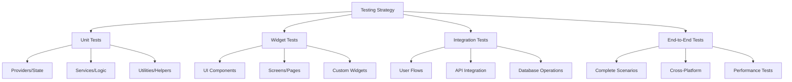

# Testing & Deployment

## 🧪 Testing Strategy Overview

The Mosquito Alert app implements a comprehensive testing strategy covering unit tests, widget tests, integration tests, and end-to-end testing to ensure reliability and quality across all features.

## 🏗️ Testing Architecture

### Test Structure



### Test Organization

```
test/
├── unit/
│   ├── providers/
│   │   ├── app_data_provider_test.dart
│   │   ├── user_data_provider_test.dart
│   │   ├── report_data_provider_test.dart
│   │   └── location_provider_test.dart
│   ├── services/
│   │   ├── auth_service_test.dart
│   │   ├── location_service_test.dart
│   │   ├── sync_service_test.dart
│   │   └── notification_service_test.dart
│   ├── utils/
│   │   ├── validators_test.dart
│   │   ├── helpers_test.dart
│   │   └── constants_test.dart
│   └── models/
│       ├── user_test.dart
│       ├── report_test.dart
│       └── location_test.dart
├── widget/
│   ├── components/
│   │   ├── report_card_test.dart
│   │   ├── location_picker_test.dart
│   │   └── camera_controls_test.dart
│   ├── screens/
│   │   ├── home_screen_test.dart
│   │   ├── report_form_test.dart
│   │   └── map_screen_test.dart
│   └── common/
│       ├── custom_button_test.dart
│       └── loading_indicator_test.dart
├── integration/
│   ├── flows/
│   │   ├── report_creation_test.dart
│   │   ├── user_authentication_test.dart
│   │   └── data_synchronization_test.dart
│   └── api/
│       ├── auth_api_test.dart
│       ├── report_api_test.dart
│       └── map_api_test.dart
└── e2e/
    ├── scenarios/
    │   ├── complete_report_flow_test.dart
    │   ├── offline_usage_test.dart
    │   └── notification_handling_test.dart
    └── performance/
        ├── startup_performance_test.dart
        └── memory_usage_test.dart
```

## 🔬 Unit Testing

### Provider Testing

```dart
// test/unit/providers/report_data_provider_test.dart
import 'package:flutter_test/flutter_test.dart';
import 'package:mockito/mockito.dart';
import 'package:mockito/annotations.dart';
import 'package:mosquito_alert/providers/report_data_provider.dart';
import 'package:mosquito_alert/models/report.dart';
import 'package:mosquito_alert/services/sync_service.dart';

import 'report_data_provider_test.mocks.dart';

@GenerateMocks([SyncService])
void main() {
  group('ReportDataProvider', () {
    late ReportDataProvider provider;
    late MockSyncService mockSyncService;
    
    setUp(() {
      mockSyncService = MockSyncService();
      provider = ReportDataProvider();
      // Inject mock service
    });
    
    tearDown(() {
      provider.dispose();
    });
    
    group('Report Creation', () {
      test('should start new report with correct type', () {
        // Arrange
        const reportType = ReportType.mosquito;
        
        // Act
        provider.startNewReport(reportType);
        
        // Assert
        expect(provider.currentDraft, isNotNull);
        expect(provider.currentDraft!.type, equals(reportType));
        expect(provider.currentDraft!.status, equals(ReportStatus.draft));
      });
      
      test('should add image to draft report', () async {
        // Arrange
        provider.startNewReport(ReportType.mosquito);
        const imagePath = '/path/to/image.jpg';
        
        // Act
        await provider.addImageToDraft(imagePath);
        
        // Assert
        expect(provider.currentDraft!.imagePaths, contains(imagePath));
      });
      
      test('should update draft location', () {
        // Arrange
        provider.startNewReport(ReportType.mosquito);
        const latitude = 41.3851;
        const longitude = 2.1734;
        const locationName = 'Barcelona, Spain';
        
        // Act
        provider.updateDraftLocation(latitude, longitude, locationName);
        
        // Assert
        expect(provider.currentDraft!.latitude, equals(latitude));
        expect(provider.currentDraft!.longitude, equals(longitude));
        expect(provider.currentDraft!.locationName, equals(locationName));
      });
      
      test('should validate report before submission', () async {
        // Arrange
        provider.startNewReport(ReportType.mosquito);
        // Don't add required fields
        
        // Act & Assert
        expect(
          () => provider.submitReport(),
          throwsA(isA<ValidationException>()),
        );
      });
      
      test('should submit valid report successfully', () async {
        // Arrange
        provider.startNewReport(ReportType.mosquito);
        await provider.addImageToDraft('/path/to/image.jpg');
        provider.updateDraftLocation(41.3851, 2.1734, 'Barcelona');
        
        when(mockSyncService.scheduleImmediateSync())
            .thenAnswer((_) async => Future.value());
        
        // Act
        await provider.submitReport();
        
        // Assert
        expect(provider.reports.length, equals(1));
        expect(provider.reports.first.status, equals(ReportStatus.pending));
        expect(provider.currentDraft, isNull);
        
        verify(mockSyncService.scheduleImmediateSync()).called(1);
      });
    });
    
    group('Report Management', () {
      test('should load reports from storage', () async {
        // Arrange
        // Mock file storage to return test reports
        
        // Act
        await provider.loadReports();
        
        // Assert
        expect(provider.isLoading, isFalse);
        expect(provider.error, isNull);
      });
      
      test('should filter pending reports correctly', () {
        // Arrange
        final reports = [
          _createTestReport(status: ReportStatus.pending),
          _createTestReport(status: ReportStatus.synced),
          _createTestReport(status: ReportStatus.pending),
        ];
        provider.setReportsForTesting(reports);
        
        // Act
        final pendingReports = provider.pendingReports;
        
        // Assert
        expect(pendingReports.length, equals(2));
        expect(pendingReports.every((r) => r.status == ReportStatus.pending), isTrue);
      });
      
      test('should update report status', () async {
        // Arrange
        final report = _createTestReport(status: ReportStatus.pending);
        provider.setReportsForTesting([report]);
        
        // Act
        await provider.updateReportStatus(report.id, ReportStatus.synced);
        
        // Assert
        final updatedReport = provider.reports.firstWhere((r) => r.id == report.id);
        expect(updatedReport.status, equals(ReportStatus.synced));
      });
    });
  });
}

Report _createTestReport({
  String? id,
  ReportStatus status = ReportStatus.draft,
}) {
  return Report(
    id: id ?? 'test_${DateTime.now().millisecondsSinceEpoch}',
    userId: 'test_user',
    type: ReportType.mosquito,
    latitude: 41.3851,
    longitude: 2.1734,
    imagePaths: ['/path/to/image.jpg'],
    createdAt: DateTime.now(),
    status: status,
  );
}
```

### Service Testing

```dart
// test/unit/services/location_service_test.dart
import 'package:flutter_test/flutter_test.dart';
import 'package:mockito/mockito.dart';
import 'package:mockito/annotations.dart';
import 'package:geolocator/geolocator.dart';
import 'package:mosquito_alert/services/location_service.dart';

@GenerateMocks([GeolocatorPlatform])
void main() {
  group('LocationService', () {
    late LocationService locationService;
    late MockGeolocatorPlatform mockGeolocator;
    
    setUp(() {
      mockGeolocator = MockGeolocatorPlatform();
      GeolocatorPlatform.instance = mockGeolocator;
      locationService = LocationService.instance;
    });
    
    group('Location Permission', () {
      test('should check location service enabled', () async {
        // Arrange
        when(mockGeolocator.isLocationServiceEnabled())
            .thenAnswer((_) async => true);
        
        // Act
        await locationService.initialize();
        
        // Assert
        expect(locationService.isLocationEnabled, isTrue);
        verify(mockGeolocator.isLocationServiceEnabled()).called(1);
      });
      
      test('should request permission when denied', () async {
        // Arrange
        when(mockGeolocator.checkPermission())
            .thenAnswer((_) async => LocationPermission.denied);
        when(mockGeolocator.requestPermission())
            .thenAnswer((_) async => LocationPermission.whileInUse);
        
        // Act
        await locationService.initialize();
        
        // Assert
        expect(locationService.hasPermission, isTrue);
        verify(mockGeolocator.requestPermission()).called(1);
      });
    });
    
    group('Location Retrieval', () {
      test('should get current position successfully', () async {
        // Arrange
        final expectedPosition = Position(
          latitude: 41.3851,
          longitude: 2.1734,
          timestamp: DateTime.now(),
          accuracy: 5.0,
          altitude: 0.0,
          altitudeAccuracy: 0.0,
          heading: 0.0,
          headingAccuracy: 0.0,
          speed: 0.0,
          speedAccuracy: 0.0,
        );
        
        when(mockGeolocator.isLocationServiceEnabled())
            .thenAnswer((_) async => true);
        when(mockGeolocator.checkPermission())
            .thenAnswer((_) async => LocationPermission.whileInUse);
        when(mockGeolocator.getCurrentPosition(locationSettings: anyNamed('locationSettings')))
            .thenAnswer((_) async => expectedPosition);
        
        // Act
        await locationService.initialize();
        final position = await locationService.getCurrentPosition();
        
        // Assert
        expect(position, isNotNull);
        expect(position!.latitude, equals(41.3851));
        expect(position.longitude, equals(2.1734));
      });
      
      test('should return cached location when recent', () async {
        // Arrange
        final cachedPosition = Position(
          latitude: 41.3851,
          longitude: 2.1734,
          timestamp: DateTime.now().subtract(Duration(minutes: 2)),
          accuracy: 5.0,
          altitude: 0.0,
          altitudeAccuracy: 0.0,
          heading: 0.0,
          headingAccuracy: 0.0,
          speed: 0.0,
          speedAccuracy: 0.0,
        );
        
        locationService.setLastKnownPositionForTesting(cachedPosition);
        
        // Act
        final position = await locationService.getCurrentPosition();
        
        // Assert
        expect(position, equals(cachedPosition));
        verifyNever(mockGeolocator.getCurrentPosition(locationSettings: anyNamed('locationSettings')));
      });
      
      test('should throw LocationException when service disabled', () async {
        // Arrange
        when(mockGeolocator.isLocationServiceEnabled())
            .thenAnswer((_) async => false);
        
        // Act & Assert
        await locationService.initialize();
        expect(
          () => locationService.getCurrentPosition(),
          throwsA(isA<LocationException>()),
        );
      });
    });
    
    group('Address Lookup', () {
      test('should format address correctly', () async {
        // Arrange
        const latitude = 41.3851;
        const longitude = 2.1734;
        
        // Mock placemarkFromCoordinates is complex, would need additional setup
        
        // Act
        final address = await locationService.getAddressFromCoordinates(
          latitude: latitude,
          longitude: longitude,
        );
        
        // Assert
        expect(address, isNotNull);
        // Add more specific assertions based on expected format
      });
    });
  });
}
```

## 🎨 Widget Testing

### Screen Testing

```dart
// test/widget/screens/home_screen_test.dart
import 'package:flutter/material.dart';
import 'package:flutter_test/flutter_test.dart';
import 'package:provider/provider.dart';
import 'package:mockito/mockito.dart';
import 'package:mosquito_alert/pages/home/home_screen.dart';
import 'package:mosquito_alert/providers/user_data_provider.dart';
import 'package:mosquito_alert/providers/report_data_provider.dart';
import 'package:mosquito_alert/providers/app_data_provider.dart';

import '../mocks.dart';

void main() {
  group('HomeScreen Widget Tests', () {
    late MockUserDataProvider mockUserProvider;
    late MockReportDataProvider mockReportProvider;
    late MockAppDataProvider mockAppProvider;
    
    setUp(() {
      mockUserProvider = MockUserDataProvider();
      mockReportProvider = MockReportDataProvider();
      mockAppProvider = MockAppDataProvider();
    });
    
    Widget createHomeScreen() {
      return MultiProvider(
        providers: [
          ChangeNotifierProvider<UserDataProvider>.value(value: mockUserProvider),
          ChangeNotifierProvider<ReportDataProvider>.value(value: mockReportProvider),
          ChangeNotifierProvider<AppDataProvider>.value(value: mockAppProvider),
        ],
        child: MaterialApp(
          home: HomeScreen(),
        ),
      );
    }
    
    testWidgets('should display splash screen when not initialized', (tester) async {
      // Arrange
      when(mockAppProvider.isInitialized).thenReturn(false);
      when(mockUserProvider.isAuthenticated).thenReturn(true);
      
      // Act
      await tester.pumpWidget(createHomeScreen());
      
      // Assert
      expect(find.byType(SplashScreen), findsOneWidget);
    });
    
    testWidgets('should display login screen when not authenticated', (tester) async {
      // Arrange
      when(mockAppProvider.isInitialized).thenReturn(true);
      when(mockUserProvider.isAuthenticated).thenReturn(false);
      
      // Act
      await tester.pumpWidget(createHomeScreen());
      
      // Assert
      expect(find.byType(LoginScreen), findsOneWidget);
    });
    
    testWidgets('should display main content when authenticated', (tester) async {
      // Arrange
      when(mockAppProvider.isInitialized).thenReturn(true);
      when(mockUserProvider.isAuthenticated).thenReturn(true);
      when(mockUserProvider.currentUser).thenReturn(_createTestUser());
      when(mockReportProvider.totalReports).thenReturn(5);
      when(mockUserProvider.totalPoints).thenReturn(50);
      
      // Act
      await tester.pumpWidget(createHomeScreen());
      
      // Assert
      expect(find.text('Hello, Test User!'), findsOneWidget);
      expect(find.text('5'), findsOneWidget); // Total reports
      expect(find.text('50'), findsOneWidget); // Total points
    });
    
    testWidgets('should navigate to camera when quick report tapped', (tester) async {
      // Arrange
      when(mockAppProvider.isInitialized).thenReturn(true);
      when(mockUserProvider.isAuthenticated).thenReturn(true);
      when(mockUserProvider.currentUser).thenReturn(_createTestUser());
      when(mockReportProvider.totalReports).thenReturn(0);
      when(mockUserProvider.totalPoints).thenReturn(0);
      
      // Act
      await tester.pumpWidget(createHomeScreen());
      await tester.tap(find.text('Quick Report'));
      await tester.pumpAndSettle();
      
      // Assert
      verify(mockReportProvider.startNewReport(ReportType.mosquito)).called(1);
    });
    
    testWidgets('should display statistics correctly', (tester) async {
      // Arrange
      when(mockAppProvider.isInitialized).thenReturn(true);
      when(mockUserProvider.isAuthenticated).thenReturn(true);
      when(mockUserProvider.currentUser).thenReturn(_createTestUser());
      when(mockReportProvider.totalReports).thenReturn(15);
      when(mockUserProvider.totalPoints).thenReturn(150);
      
      // Act
      await tester.pumpWidget(createHomeScreen());
      
      // Assert
      expect(find.text('Total Reports'), findsOneWidget);
      expect(find.text('15'), findsOneWidget);
      expect(find.text('Points'), findsOneWidget);
      expect(find.text('150'), findsOneWidget);
    });
  });
}

User _createTestUser() {
  return User(
    id: 'test_user_id',
    email: 'test@example.com',
    displayName: 'Test User',
    createdAt: DateTime.now(),
    preferences: UserPreferences(),
    statistics: UserStatistics(),
  );
}
```

### Component Testing

```dart
// test/widget/components/report_card_test.dart
import 'package:flutter/material.dart';
import 'package:flutter_test/flutter_test.dart';
import 'package:mosquito_alert/widgets/report_card.dart';
import 'package:mosquito_alert/models/report.dart';

void main() {
  group('ReportCard Widget Tests', () {
    late Report testReport;
    
    setUp(() {
      testReport = Report(
        id: 'test_report',
        userId: 'test_user',
        type: ReportType.mosquito,
        latitude: 41.3851,
        longitude: 2.1734,
        locationName: 'Barcelona, Spain',
        imagePaths: ['/path/to/image.jpg'],
        notes: 'Test mosquito sighting',
        createdAt: DateTime(2024, 1, 15, 14, 30),
        status: ReportStatus.synced,
      );
    });
    
    Widget createReportCard({
      Report? report,
      VoidCallback? onTap,
    }) {
      return MaterialApp(
        home: Scaffold(
          body: ReportCard(
            report: report ?? testReport,
            onTap: onTap,
          ),
        ),
      );
    }
    
    testWidgets('should display report information correctly', (tester) async {
      // Act
      await tester.pumpWidget(createReportCard());
      
      // Assert
      expect(find.text('Mosquito Report'), findsOneWidget);
      expect(find.text('Barcelona, Spain'), findsOneWidget);
      expect(find.text('Test mosquito sighting'), findsOneWidget);
      expect(find.text('Jan 15, 2024 at 2:30 PM'), findsOneWidget);
    });
    
    testWidgets('should show correct status indicator', (tester) async {
      // Act
      await tester.pumpWidget(createReportCard());
      
      // Assert
      expect(find.byIcon(Icons.check_circle), findsOneWidget);
      expect(find.text('Synced'), findsOneWidget);
    });
    
    testWidgets('should show pending status for pending reports', (tester) async {
      // Arrange
      final pendingReport = testReport.copyWith(status: ReportStatus.pending);
      
      // Act
      await tester.pumpWidget(createReportCard(report: pendingReport));
      
      // Assert
      expect(find.byIcon(Icons.sync), findsOneWidget);
      expect(find.text('Pending'), findsOneWidget);
    });
    
    testWidgets('should call onTap when tapped', (tester) async {
      // Arrange
      bool tapped = false;
      void onTap() => tapped = true;
      
      // Act
      await tester.pumpWidget(createReportCard(onTap: onTap));
      await tester.tap(find.byType(ReportCard));
      
      // Assert
      expect(tapped, isTrue);
    });
    
    testWidgets('should display image when available', (tester) async {
      // Act
      await tester.pumpWidget(createReportCard());
      
      // Assert
      expect(find.byType(Image), findsOneWidget);
    });
    
    testWidgets('should handle missing location name', (tester) async {
      // Arrange
      final reportWithoutLocation = testReport.copyWith(locationName: null);
      
      // Act
      await tester.pumpWidget(createReportCard(report: reportWithoutLocation));
      
      // Assert
      expect(find.text('41.3851, 2.1734'), findsOneWidget);
    });
  });
}
```

## 🔄 Integration Testing

### Flow Testing

```dart
// test/integration/flows/report_creation_test.dart
import 'package:flutter/material.dart';
import 'package:flutter_test/flutter_test.dart';
import 'package:integration_test/integration_test.dart';
import 'package:mosquito_alert/main.dart' as app;
import 'package:mosquito_alert/services/location_service.dart';
import 'package:geolocator/geolocator.dart';

void main() {
  IntegrationTestWidgetsFlutterBinding.ensureInitialized();
  
  group('Report Creation Flow', () {
    testWidgets('complete mosquito report creation', (tester) async {
      // Initialize app
      app.main();
      await tester.pumpAndSettle();
      
      // Skip onboarding if present
      if (find.text('Get Started').tryEvaluate().isNotEmpty) {
        await tester.tap(find.text('Get Started'));
        await tester.pumpAndSettle();
      }
      
      // Navigate to camera screen
      await tester.tap(find.text('Report Mosquito'));
      await tester.pumpAndSettle();
      
      // Wait for camera initialization
      await tester.pump(Duration(seconds: 2));
      
      // Take a photo
      await tester.tap(find.byIcon(Icons.camera));
      await tester.pumpAndSettle();
      
      // Fill report form
      await tester.enterText(find.byType(TextField), 'Test mosquito report');
      await tester.pumpAndSettle();
      
      // Confirm location (assuming location permission is granted)
      if (find.text('Use Current Location').tryEvaluate().isNotEmpty) {
        await tester.tap(find.text('Use Current Location'));
        await tester.pumpAndSettle();
      }
      
      // Submit report
      await tester.tap(find.text('Submit Report'));
      await tester.pumpAndSettle();
      
      // Verify success message
      expect(find.text('Report submitted successfully'), findsOneWidget);
      
      // Verify navigation back to home
      expect(find.text('Home'), findsOneWidget);
      
      // Check that report appears in reports list
      await tester.tap(find.text('Reports'));
      await tester.pumpAndSettle();
      
      expect(find.text('Test mosquito report'), findsOneWidget);
    });
    
    testWidgets('handle location permission denied', (tester) async {
      // This test would require mocking location permissions
      // Implementation depends on testing framework setup
    });
    
    testWidgets('handle offline report creation', (tester) async {
      // Initialize app
      app.main();
      await tester.pumpAndSettle();
      
      // Simulate offline mode
      // This would require network mocking
      
      // Create report
      await tester.tap(find.text('Report Mosquito'));
      await tester.pumpAndSettle();
      
      // Take photo and fill form
      await tester.tap(find.byIcon(Icons.camera));
      await tester.pumpAndSettle();
      
      await tester.enterText(find.byType(TextField), 'Offline test report');
      await tester.pumpAndSettle();
      
      // Submit report
      await tester.tap(find.text('Submit Report'));
      await tester.pumpAndSettle();
      
      // Verify offline message
      expect(find.textContaining('saved locally'), findsOneWidget);
      
      // Simulate network restoration
      // Verify automatic sync
    });
  });
}
```

## 🚀 Deployment Configuration

### CI/CD Pipeline

```yaml
# .github/workflows/ci_cd.yml
name: CI/CD Pipeline

on:
  push:
    branches: [ main, develop ]
  pull_request:
    branches: [ main ]

jobs:
  test:
    runs-on: ubuntu-latest
    steps:
    - uses: actions/checkout@v3
    
    - name: Setup Flutter
      uses: subosito/flutter-action@v2
      with:
        flutter-version: '3.19.0'
        channel: 'stable'
    
    - name: Install dependencies
      run: flutter pub get
    
    - name: Run analyzer
      run: flutter analyze
    
    - name: Run unit tests
      run: flutter test --coverage
    
    - name: Upload coverage
      uses: codecov/codecov-action@v3
      with:
        file: coverage/lcov.info
    
    - name: Run widget tests
      run: flutter test test/widget/
    
    - name: Run integration tests
      run: flutter test integration_test/
  
  build-android:
    needs: test
    runs-on: ubuntu-latest
    if: github.ref == 'refs/heads/main'
    steps:
    - uses: actions/checkout@v3
    
    - name: Setup Flutter
      uses: subosito/flutter-action@v2
      with:
        flutter-version: '3.19.0'
        channel: 'stable'
    
    - name: Setup Java
      uses: actions/setup-java@v3
      with:
        distribution: 'zulu'
        java-version: '17'
    
    - name: Install dependencies
      run: flutter pub get
    
    - name: Build APK
      run: flutter build apk --release
    
    - name: Build App Bundle
      run: flutter build appbundle --release
    
    - name: Upload artifacts
      uses: actions/upload-artifact@v3
      with:
        name: android-release
        path: |
          build/app/outputs/flutter-apk/app-release.apk
          build/app/outputs/bundle/release/app-release.aab
  
  build-ios:
    needs: test
    runs-on: macos-latest
    if: github.ref == 'refs/heads/main'
    steps:
    - uses: actions/checkout@v3
    
    - name: Setup Flutter
      uses: subosito/flutter-action@v2
      with:
        flutter-version: '3.19.0'
        channel: 'stable'
    
    - name: Install dependencies
      run: flutter pub get
    
    - name: Build iOS
      run: |
        cd ios
        pod install
        cd ..
        flutter build ios --release --no-codesign
    
    - name: Upload artifacts
      uses: actions/upload-artifact@v3
      with:
        name: ios-release
        path: build/ios/iphoneos/Runner.app
```

### Build Configuration

```dart
// build_config.dart
class BuildConfig {
  static const Environment environment = Environment.fromEnvironment(
    'ENVIRONMENT',
    defaultValue: Environment.development,
  );
  
  static const String version = String.fromEnvironment(
    'VERSION',
    defaultValue: '1.0.0',
  );
  
  static const int buildNumber = int.fromEnvironment(
    'BUILD_NUMBER',
    defaultValue: 1,
  );
  
  static bool get isDebug => environment == Environment.development;
  static bool get isRelease => environment == Environment.production;
  
  static String get appName {
    switch (environment) {
      case Environment.development:
        return 'Mosquito Alert Dev';
      case Environment.testing:
        return 'Mosquito Alert Test';
      case Environment.production:
        return 'Mosquito Alert';
    }
  }
  
  static String get bundleId {
    switch (environment) {
      case Environment.development:
        return 'com.mosquitoalert.app.dev';
      case Environment.testing:
        return 'com.mosquitoalert.app.test';
      case Environment.production:
        return 'com.mosquitoalert.app';
    }
  }
}

enum Environment {
  development,
  testing,
  production,
}
```

### Release Checklist

```markdown
# Release Checklist

## Pre-Release
- [ ] All tests passing
- [ ] Code coverage > 80%
- [ ] Performance benchmarks meet requirements
- [ ] Security audit completed
- [ ] Dependencies updated and verified
- [ ] Documentation updated
- [ ] Changelog updated

## Build Verification
- [ ] Android APK/AAB builds successfully
- [ ] iOS IPA builds successfully
- [ ] All signing certificates valid
- [ ] Proper app icons and metadata
- [ ] Version numbers incremented

## Testing
- [ ] Manual testing on physical devices
- [ ] Automated tests pass on CI/CD
- [ ] Performance testing completed
- [ ] Accessibility testing completed
- [ ] Network condition testing (offline/poor connectivity)

## Store Preparation
- [ ] App store descriptions updated
- [ ] Screenshots updated for all supported devices
- [ ] Store assets (icons, promotional images) prepared
- [ ] Privacy policy and terms updated
- [ ] App store optimization completed

## Deployment
- [ ] Internal testing release deployed
- [ ] Beta testing group notified
- [ ] Beta feedback incorporated
- [ ] Production release deployed
- [ ] Release announcement prepared
- [ ] Monitoring and analytics configured

## Post-Release
- [ ] Monitor crash reports
- [ ] Monitor user feedback
- [ ] Monitor app performance metrics
- [ ] Monitor API usage and errors
- [ ] Prepare hotfix if needed
```

This comprehensive testing and deployment strategy ensures the Mosquito Alert app maintains high quality and reliability throughout its development lifecycle.
